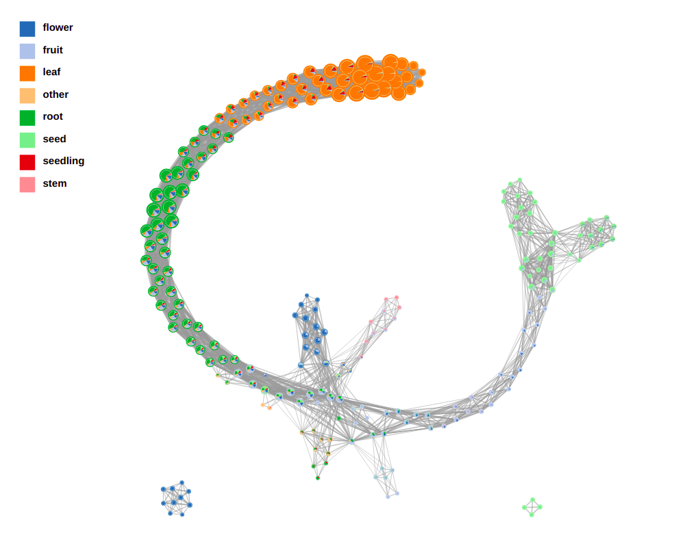
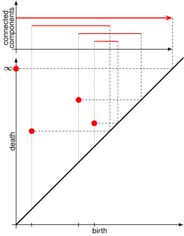

<style type="text/css">
.tg  {border-collapse:collapse;border-color:#93a1a1;border-spacing:0;margin:0px auto;}
.tg td{background-color:#fdf6e3;border-bottom-width:1px;border-color:#93a1a1;border-style:solid;border-top-width:1px;
  border-width:0px;color:#002b36;font-family:Arial, sans-serif;font-size:14px;overflow:hidden;padding:10px 5px;
  word-break:normal;}
.tg th{background-color:#657b83;border-bottom-width:1px;border-color:#93a1a1;border-style:solid;border-top-width:1px;
  border-width:0px;color:#fdf6e3;font-family:Arial, sans-serif;font-size:14px;font-weight:normal;overflow:hidden;
  padding:10px 5px;word-break:normal;}
.tg .tg-2bhk{background-color:#eee8d5;border-color:inherit;text-align:left;vertical-align:top}
.tg .tg-0pky{border-color:inherit;text-align:left;vertical-align:top}
.tg .tg-gyvr{background-color:#eee8d5;border-color:inherit;font-size:100%;text-align:left;vertical-align:top}
</style>

```{r setup, include=FALSE}
library(tibble)
library(magrittr)
library(glue)
library(knitr)

# <!-- Copies an HTML dependency to a subdirectory of the given directory. The subdirectory name willbename-version(for example, "outputDir/jquery-1.11.0"). You may setoptions(htmltools.dir.version= FALSE)to suppress the version number in the subdirectory name. -->
options(htmltools.dir.version = FALSE)
knitr::opts_chunk$set(echo = FALSE)
knitr::opts_chunk$set(fig.align = 'center')
```

class: inverse

# Shape has data, and data has shape

<div class="row">
  <div class="column" style="max-width:19%">
    </img>
    </img>
  </div>
  <div class="column" style="max-width:39%">
    <iframe width="375" height="210" src="https://www.youtube-nocookie.com/embed/LxNSbrfq3kY?si=Qw9qv3Og1XcPIUyg" title="YouTube video player" frameborder="0" allow="accelerometer; autoplay; clipboard-write; encrypted-media; gyroscope; picture-in-picture; web-share" allowfullscreen></iframe>
    </img>
  </div>
  <div class="column" style="max-width:41%">
    </img>
    </img>
  </div>
</div>

---

background-image: url("../../demat/figs/fam9_3.png")
background-size: 100px
background-position: 98% 2%

# From MX to MI to MO at MU

.left-column[

]

.right-column[
- 2013 - 2018 : Math @ at the Universidad de Guanajuato and CIMAT.

- 2016 - 2018 : Bachelor thesis: **Math + Archaeology**. Use TDA to quantify and classify the shape of pre-Columbian masks found in the Templo Mayor in Mexico City.

- 2018 - 2023 : CMSE @ Michigan State University. **Came for the math. Stayed for the plants.**

- 2023 - ???? : PFFIE Postdoc Fellow @ Division of Plant Sciences & Department of Mathematics at Mizzou

]

&mdash;&mdash;&mdash;&mdash;&mdash;

<div class="row">
  <div class="column" style="max-width:49%">
    <iframe width="375" height="210" src="https://www.youtube-nocookie.com/embed/oM9kAq0PBvw?controls=0" frameborder="0" allow="accelerometer; autoplay; encrypted-media; gyroscope; picture-in-picture" allowfullscreen></iframe>
  </div>
  <div class="column" style="max-width:49%">
    <iframe width="375" height="210" src="https://www.youtube-nocookie.com/embed/V39K58evWlU?controls=0" frameborder="0" allow="accelerometer; autoplay; encrypted-media; gyroscope; picture-in-picture" allowfullscreen></iframe>
  </div>
</div>

---

# Roadmap for today

- **I promise you the bulk of slides are just stills from time-lapses**

- It is impossible to cover all there is to know about Topological Data Analysis in a single session

- Go over some basic lingo and applications

- Leave plenty of pointers

- Slides available

---

class: inverse, middle, center

# 1. Motivating Persistence

## Single-linkage clustering

---

background-image: url("../figs/circs2kiss_just_points.svg")
background-size: 500px
background-position: 50% 95%

# How many connected componets you see?

- Infer the underlying topology of a *sampled* finite metric space

- Beyond the naive discrete topology

---

background-image: url("../figs/circs2kiss_just_points.svg")
background-size: 500px
background-position: 50% 95%

# Single linkage clustering of $X$

- For $R\geq0$, consider the relation $\sim_R$
$$x\sim_Rx'\Leftrightarrow d(x,x')\leq R.$$
- Let $\simeq_R$ be the equivalence relation generated by $\sim_R$.
- The equivalence classes under $\simeq_R$ partition $X$ into connected components
- Different $R$s can generate different partitions

- *"What is the right $R$?"*: Ill-posed question

---

```{r include=FALSE}
slides_info <- tibble::tibble(first  = formatC(0:19, digits=2, format='d', flag='0'))

slides_text <- glue::glue_data(
  slides_info,
  "
  background-image: url(\"../figs/circs2kiss_vr0_{first}.svg\")
  background-size: 800px
  background-position: 50% 75%

  # Compatibility accross changes in $R$

  $$x\\sim_Rx'\\Leftrightarrow d(x,x')\\leq R.$$

  - If $R\\leq R'$, then the partition $X_R$ by $\\simeq_R$ is coarser than the partition $X_{{R'}}$ by $\\simeq_{{R'}}$
  "
)
```

`r slides_text %>% paste(collapse = "\n---\n")`

---

class: inverse, middle, center

# Persistence set

## Why take one value when you can take all of them?

---

# Definition: Persistent set

- A *persistent set* is a family of sets $\{X_R\}_{R\in\mathbb{R}}$ together with set maps
$$\varphi_R^{R'}\;:\;X_R\to X_{R'}\quad\text{for all}\quad R\leq R',$$
- so that
$$\varphi_{R'}^{R''}\varphi_{R}^{R'} = \varphi_{R}^{R''}\quad\text{for all}\quad R\leq R'\leq R''.$$

- The $X_R$s can be simplicial complexes, vector spaces, topological spaces, etc. 

###  Persistent Homology

- Your good, ol' simplicial homology but parameterized by $\mathbb{R}$.

---

# 1st TDA Ingredient: Complexes

- Think the data as a collection of elementary building blocks ( _simplices_ )

Vertices | Edges | Faces | Tetrahedra
---------|-------|-------|-------
  0-dim  | 1-dim | 2-dim | 3-dim

- A collection of cells is a _simplicial complex_

- Count the number of topologically invariant features ( _holes_ ):

Connected components | Loops | Voids
---------------------|-------|-------
       0-dim         | 1-dim | 2-dim

- Example with 3 connected components, 1 loop, 1 voids

```{r, out.width=350}
knitr::include_graphics("../figs/complex-good.svg")
```

---

# 2nd TDA Ingredient: Filters

- Each cell is assigned a real value which defines how the complex is constructed.

- Observe how the number of topological features change as the complex grows.

.pull-left[
```{r, out.width="250px"}
knitr::include_graphics(c("../../barley/figs/eigcurv_filter.gif", "../../barley/figs/gaussian_density_filter.gif"))
```
]

.pull-right[
```{r, out.width="250px"}
knitr::include_graphics(c("../../barley/figs/eccentricity_filter.gif", "../../barley/figs/vrips_ver2.gif"))
```
]

---

class: inverse, center, middle

# Persistent Homology

## Your good, ol' simplicial homology but parameterized by $\mathbb{R}$.

---

# Ye olde simplicial homology

- A $d$-dimensional simplex $\sigma$ is the convex hulls of $d$ vertices in general position.

```{r, out.width=300}

```

- Simplicial complexes **K** are collections of nicely glued simplices.

.pull-left[
```{r, out.width=300}
knitr::include_graphics("../figs/complex-good.svg")
```
- Good complex
]

.pull-right[
```{r, out.width=300}

```
- Bad complex
]

- Define *q-chains* $C_q = \left\{\sum_{k=1}^r \lambda_k\sigma_k\,:\,\lambda_k\in\mathbb{Z_2},\,\sigma_k \textrm{ a } q\textrm{-simplex}\right\}$.

- Favor the use $\mathbb{Z_2}$ instead of $\mathbb{Z}$ to keep things manageable.

---

# Ye olde groups of homology

- $\partial_q:C_q\to C_{q-1}$ with $\partial\sigma= \sum_{i=0}^q (-1)^i(\mathbf v_0,\ldots,\mathbf v_{i-1},\mathbf v_{i+1}, \ldots, \mathbf v_{n}).$

- Recall that $\partial^2 = \partial_q\circ\partial_{q-1}=0$.

```{r, out.width=500}

```

- $\partial_2(\partial_3(K)) = \mathbf{(v-u)+(w-v)+(x-w)+(y-x)+(u-y)=0}$.

- Group of *q-cycles* $Z_q(K) = \ker\partial_q$.

- Group of *q-boundary cycles* $B_q(K) = \text{im}\:\partial_{q+1}$

- The *q-th group of homology* is $H_q(K)=Z_q(K)/B_q(K)$

- The *q-th Betti number* is $\beta_q(K)=\dim(H_q(K))$
	
---

# Now throw in persistence

- A *filtration* of simplicial complex $\mathbf K$ is a collection of nested subcomplexes $\mathbf K_0\subset\mathbf K_0\subset\ldots\subset\mathbf K_m=\mathbf K$.

```{r, out.width=400}
knitr::include_graphics("https://www.frontiersin.org/files/Articles/637684/fphys-12-637684-HTML/image_m/fphys-12-637684-g003.jpg")
```

- We have canonical inclusions $\iota_{i,j}:\mathbf K_i\to\mathbf K_j$.

- We see that $\iota_{i,k} = \iota_{j,k}\circ\iota_{i,j}$ for any $0\leq i\leq j\leq k\leq m$.

- (Abusing notation) These correspond to inclusions $\iota_{i,j}:H_q(\mathbf K_i)\to H_q(\mathbf K_j)$ for $q=0,1,2,\ldots$.

- The $(i,j)$-th persistent $q$-th homology group is $H_{i,j;q}(\mathbf K) = \text{Im}\,(\iota_{i,j})$.

- It's dimension is the $(i,j)$-th persistent $q$-th Betti number, $\beta_{i,j;q}(\mathbf K)$.

- A class $\alpha\in H_q(\mathbf K_i)$ *is born* at time $i$ if $\alpha\notin H_{i-1,i;q}(\mathbf K)$.

- This class $\alpha\in H_q(\mathbf K_j)$ *dies* at time $j+1$ if $\iota_{j,j+1}(\alpha)\in H_{i,j;q}(\mathbf K)$.

---

```{r include=FALSE}
slides_info <- tibble::tibble(first  = formatC(0:7, digits=1, format='d', flag='0'))

slides_text <- glue::glue_data(
  slides_info,
  "
  background-image: url(\"../figs/vr1_{first}.svg\")
  background-size: 500px
  background-position: 50% 90%

  # A toy Vietoris-Rips filtration example
  
  Consider a collection of vertices $\\{{v_\\lambda\\}}_{{\\lambda\\in\\Lambda}}$ and $r\\geq0$. The subset $\\{{v_0,\\ldots,v_n\\}}$ is a simplex in the $VR(r)$ simplicial complex iff
  $$d(v_i,v_j)\\leq r\\quad\\text{{ for all }}\\quad i,j\\in\\{{0,\\ldots,n\\}}.$$
  
  "
)
```

`r slides_text %>% paste(collapse = "\n---\n")`

---

background-image: url("../figs/barcode_vr1.svg")
background-size: 600px
background-position: 50% 90%
  
# Summarizing results in a barcode

.pull-left[
```{r, out.width=400}
knitr::include_graphics("../figs/vr1_summary.svg")
```
]

.pull-right[
- Five connected components are born from the get-go

- Four of them merge into one at $r_4$

- A hole is born with this merge

- This hole eventually is filled with triangles at $r_6$.
]

---

# Persistence diagrams


.pull-left[
```{r, out.width=400}

```
]

.pull-right[
- Consider $C_{i,j;q}$ all the $q$-classes that are born at time $i$ and die at time $j$

- The associated persistence diagram $\text{dgm}(\mathcal{F})$ is a multiset

$\text{dgm}(\mathcal{F}) = \bigcup_{q=0}^{n}\{(i,j) : \alpha_{i,j;q}\in C_{i,j;q}\}\cup\textrm{diag}$

]

---

background-image: url("../figs/bottleneck_diagram.svg")
background-size: 600px
background-position: 50% 90%

# Bottleneck distance and stability

- Consider $\text{dgm}_1$, $\text{dgm}_2$ two persistence diagrams. The *bottleneck distance$ between them is

$$d_B(\text{dgm}_1,\text{dgm}_2) = \inf_\gamma\sup_{p\in\text{dgm}_1}\|p-\gamma(p)\|_\infty.$$

- Where $\gamma$ is a bijection between the $q$-th $\text{dgm}_1$ and $\text{dgm}_2$

- **Persistence diagrams are stable under the bottleneck distance!**

---

class: inverse, center, middle

# A word on statistical caution

```{r, out.width=400}

```

---

background-image: url("https://anatomypubs.onlinelibrary.wiley.com/cms/asset/affff43e-32c2-4f91-ade4-e1d3020ed4ee/dvdy175-fig-0005-m.jpg")
background-size: 500px
background-position: 50% 90%

# The underbelly

- The space of persistence diagrams is notoriously difficult to work with

- Hard to deal with Hausdorff noise

- Plenty of open questions on multiparameter persistence (parameterizing simplicial homology with $\mathbb{R}^m$).

- Unclear on how to distinguish noise from nuanced signal

- **Interpretability** of the results: what does a persistent diagram really represents?


---

background-image: url("../figs/mapper_b_11.svg")
background-size: 425px
background-position: 50% 95%

# Plenty of topics left to cover

- Persistence landscapes, persistence images, and other more amenable representations of persistent topological features.

- Bootstraping to distinguish noise from signal.

- Density-based bi-parameter persistence to deal with Hausdorff noise.

- A central-limit-theorem-like theorem for persistence for different classic topological spaces and other probabilistic insights.

- Persistent Homology Transform and the Euler Characteristic Transform.

- Reducing and clustering high-dimensional data with Mapper.

---

class: inverse, middle, center

# Literature examples

---

### Detecting holes &rarr; detect cancerous tissue

.pull-left[

]

.pull-right[

]

<p style="font-size: 10px; text-align: right; color: Grey;"> Credits: <a href="https://doi.org/10.1016/j.media.2019.03.014">Qaiser <em>et al.</em> (2019)</a></p>

---

### Detect holes &rarr; detect reassortment and horizontal evolution

.pull-left[

]

.pull-right[

]

<p style="font-size: 10px; text-align: right; color: Grey;"> Credits: <a href="https://doi.org/10.1073/pnas.1313480110">Chan <em>et al.</em> (2013)</a></p>

---

### Detect holes &rarr; detect open and closed conformations

.pull-left[


]

.pull-right[

]

<p style="font-size: 10px; text-align: right; color: Grey;"> Credits: <a href="https://doi.org/10.1515/sagmb-2015-0057">Kovacev-Nikolic <em>et al.</em> (2016)</a></p>

---

### Detect componets across the morphospace &rarr; detect leaf development

```{r, out.width=450}
knitr::include_graphics('../figs/g86.png')
```

<p style="font-size: 10px; text-align: right; color: Grey;"> Credits: <a href="https://doi.org/10.1101/2023.07.14.549010">Percival <em>et al.</em> (2023)</a></p>

---

### Detect changes in Euler characteristics &rarr; detect different barley varieties

<div class="row">
  <div class="column" style="max-width:25%; font-size: 15px;">
    
    <p style="font-size: 20px; text-align: center; color: DarkRed;">X-ray CT scans</p>
  </div>
  <div class="column" style="max-width:40%; padding: 0 25px 0 25px; font-size: 15px;">
    
    <p style="font-size: 20px; text-align: center; color: DarkRed;">Euler Characteristic Transform</p>
  </div>
  <div class="column" style="max-width:35%; font-size: 15px;">
    <table class="tg">
<thead>
  <tr>
    <th class="tg-0pky">Shape descriptors</th>
    <th class="tg-0pky">No. of descriptors</th>
    <th class="tg-0pky">F1</th>
  </tr>
</thead>
<tbody>
  <tr>
    <td class="tg-2bhk">Traditional</td>
    <td class="tg-2bhk">11</td>
    <td class="tg-2bhk">0.55 &plusmn; 0.019</td>
  </tr>
  <tr>
    <td class="tg-0pky">Topological + UMAP</td>
    <td class="tg-0pky">12</td>
    <td class="tg-0pky">0.74 &plusmn; 0.016</td>
  </tr>
  <tr>
    <td class="tg-2bhk">Combined</td>
    <td class="tg-2bhk">23</td>
    <td class="tg-2bhk">0.86 &plusmn; 0.010</td>
  </tr>
</tbody>
</table>
    <p style="font-size: 20px; text-align: center; color: DarkRed;">Classify 28 different accessions</p>
  </div>
</div>
<p style="font-size: 10px; text-align: right; color: Grey;"> Credits: <a href="https://doi.org/10.1093/insilicoplants/diab033">Amézquita <em>et al.</em> (2023)</a></p>


---


class: inverse, middle, center

# Applied Topology $\oplus$ Plant Biology

## Current projects in the works

---

## Quantifying the movement of plants and genes

<div style="text-align:center;">
<video width="500" controls>
  <source src="../../cuscuta/video/4pm_rep7_plant_00.mp4" type="video/mp4">
</video>
</div>
<p style="font-size: 9px; text-align: right; color: Grey;"> Credits: Park Lab. <em>In progress</em></p>

```{r, out.width=500}
knitr::include_graphics("../../mcarto/figs/A1_-_CYP93A1_kde_0.25.jpg")
```
<p style="font-size: 9px; text-align: right; color: Grey;"> Credits: Libault Lab. <em>In progress</em></p>

---

class: inverse, middle, center

# Where to go now?

---

# Literature review and growing community

```{r, out.width=500}
knitr::include_graphics("../figs/amezquita_etal_2020.png")
```

.pull-left[

]

.pull-right[

- Applied Algebraic Topology Research Network
]

---

background-image: url("https://lh5.googleusercontent.com/vYDMaU7pTcgKtQ3WqwqBVWcL4ckz5k8Mfseh3KzN53O7nUDUUKox-ISPBIloXZDoi6_a5XNfQanQ6dRGhU7A1-w=w16383")
background-size: 100px
background-position: 99% 1%

# AATRN

<p align="center">
<iframe width="800" height="500" src="https://www.aatrn.net/home" title="AATRN">
</iframe>
</p>
<p style="font-size: 10px; text-align: right; color: Grey;"><a href="https://www.aatrn.net/home" target="_blank">Original link</a></p>

---

# Actively mantained C/C++ and python

.pull-left[

- [gudhi](https://gudhi.inria.fr/)

```{r, out.width=200}
knitr::include_graphics("https://scikit-tda.org/_images/ripser.png")
```
- [ripser](https://github.com/Ripser/ripser)
]

.pull-right[

- [giotto-tda](https://github.com/giotto-ai/giotto-tda)

```{r, out.width=200}
knitr::include_graphics("https://scikit-tda.org/_static/logo.png")
```
- [scikit-tda](https://scikit-tda.org/)
]

---

class: inverse

# Thanks!

- eah4d@missouri.edu

- 240a Bond Life Sciences Center Building

- [https://ejamezquita.github.io/](https://ejamezquita.github.io/)

- Slides: https://ejamezquita.github.io/tda/slides/mizzou_2023.html

## Questions?

```{r, out.width=200}
knitr::include_graphics("https://64.media.tumblr.com/895f079d8cc1128b5ce3ca7aacf57389/9ff35c052f5d8802-16/s500x750/55486cc6b04f5f7192d0002707ca8b7e550e4db8.gifv")
```
