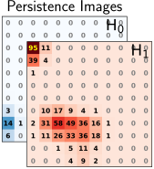
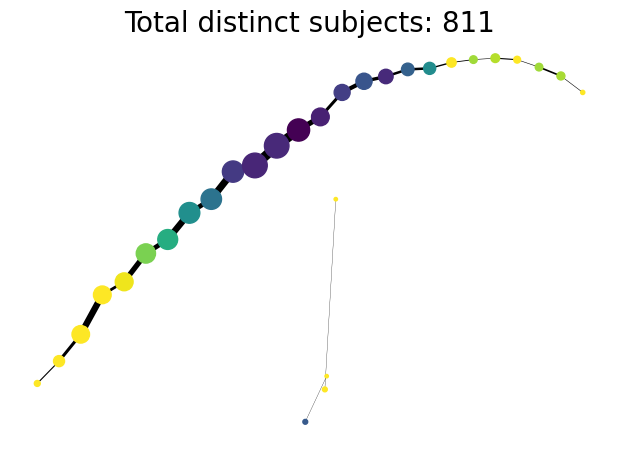

```{r setup, include=FALSE}
library(knitr)
library(magrittr)
genes = c('GLYMA_17G195900', 'GLYMA_05G092200')
options(htmltools.dir.version = FALSE)
knitr::opts_chunk$set(echo = FALSE)
knitr::opts_chunk$set(fig.align = 'center')
```

background-image: url("../../demat/figs/fam9_3.png")
background-size: 100px
background-position: 98% 2%

# About me: From MX to MI to MO at MU

## I work across multiple disciplines and countries

.left-column[

]

.right-column[
- 2013 - 2018 : Licenciatura (Bachelor): Mathematics @ Universidad de Guanajuato and CIMAT. 
- 2018 - 2023 : PhD: Computational Mathematics, Science &amp; Engineering @ Michigan State University 
- 2023 - 2025 : ~~PFFFD~~ ~~PFFIE~~ PFF Postdoctoral Fellow: Plant Science / Mathematics @ University of Missouri (MU).
- 2025 - present: Assistant Professor: Plant Science / Math @ MU. 
]

---

background-image: url("../../demat/figs/ecg_results.png")
background-size: 700px
background-position: 50% 80%

# College &rarr; TDA &oplus; Archaeology

Topological Data Analysis for pre-Columbian mask classification

--

.pull-left[

```{r, out.width=310}
knitr::include_graphics("../../demat/figs/barrett_poster-1.jpg")
```
]

--

.pull-right[


```{r, eval=FALSE, echo=TRUE}
*- Lessons learned for better 
* future interdisciplinary 
* collaborations
  
*- Always include the other
* discipline experts at
* every stage of the analysis

*- Learn the basics of other
* people disciplines
```
]

---

# TDA &oplus; Archaeology: retold

.pull-left[


<p style="font-size: 10px; text-align: center; color: Grey;">Credits: <a href="http://mediateca.inah.gob.mx/repositorio/islandora/object/tesis%3A4497">Olmedo Vera and Gonz&aacute;lez (1986)</a></p>
]

.pull-right[

]

---

class: inverse, center, middle

# A mathematician by training, a data scientist by trade, and a plant biologist by ~~collaboration~~ osmosis

```{r, out.width=400}
knitr::include_graphics("../../biology/figs/osmosis-in-plant-cell.png")
```

---

background-image: url("../../arabidopsis/figs/PFig1.png")
background-size: 900px
background-position: 50% 70%

# Shape quantification &oplus; Plant Science

- Quantifying the intuition
- Intuifying the quantities

---

# Come for the math, stay for the plants

<div class="row" style="font-family: 'Yanone Kaffeesatz'; font-size:22px;">
  <div class="column" style="max-width:33%">
    <p style="line-height:0;text-align: center; font-size:28px">The shape of adaptability</p>
    </img>
    </img>
    <p style="text-align: center;">Topological Data Analysis</p>
    <p style="text-align: center;">Euler Characteristic Transform</p>
  </div>
  <div class="column" style="max-width:33%">
    <p style="line-height:0;font-size:28px;text-align: center;">The shape of development</p>
    </img>
    </img>
    <p style="text-align: center;">Ellipsoidal modeling</p>
    <p style="text-align: center;">Directional statistics</p>
  </div>
  <div class="column" style="max-width:33%">
    <p style="line-height:0;font-size:28px;text-align: center;">The shape of domestication</p>
    </img>
    </img>
    <p style="text-align: center;">Allometry of multiple tissues</p>
    <p style="text-align: center;">Convexity indices</p>
  </div>
</div>

---

# Phenotyping the shape of things to come

<div class="row" style="font-family: 'Yanone Kaffeesatz'; font-size:22px;">
  <div class="column" style="max-width:33%">
    <p style="line-height:0;text-align: center; font-size:28px">Phenotyping patterns</p>
    </img>
    </img>
    <p style="text-align: center;">mRNA sub-cellular localization in soybean nodule cells.</p>
  </div>
  <div class="column" style="max-width:33%">
    <p style="line-height:0;font-size:28px;text-align: center;">Phenotyping movement</p>
    </img>
    </img>
    <p style="text-align: center;">Tracking and describing <i>Cuscuta campestris</i> circumnutation</p>
  </div>
  <div class="column" style="max-width:33%">
    <p style="line-height:0;font-size:28px;text-align: center;">Phenotyping data</p>
    </img>
    </img>
    <p style="text-align: center;">Reducing <strong>and</strong> clustering high-dimensional omics data</p>
  </div>
</div>

---


class: inverse, middle, center

# The culture shock of switching disciplines has been greater than that of switching countries

```{r, out.width=500}
knitr::include_graphics("../../img/homotopy_botany.png")
```

# But it is fun

---

background-image: url("../../barley/figs/seed.png")
background-size: 325px
background-position: 99% 99%

class: middle

# Roadmap for today

1. Phenotyping shapes: barley seeds
   - Euler Characteristic Transform

1. Phenotyping patterns: mRNA localization in soybean
   - Sublevel set persistence
   - Persistence Images

1. Phenotyping data: lung tissue RNAseq 
   - Mapper
   
1. Current plant data and TDA opportunities

---

class: inverse, middle, center

# Phenotyping shapes

## How _shape-y_ &nbsp; is a shape?

```{r, out.width=500}
knitr::include_graphics("../../barley/figs/amezquita_etal_2021.png")
```

---

background-image: url("https://ars.els-cdn.com/content/image/1-s2.0-S1369526620300339-fx1_lrg.jpg")
background-size: 1100px
background-position: 50% 40%

# A crash course in plant breeding

<br>&nbsp;<br>&nbsp;<br>&nbsp;<br>&nbsp;<br>&nbsp;<br>&nbsp;<br>&nbsp;<br>&nbsp;<br>&nbsp;<br>&nbsp;<br>&nbsp;<br>&nbsp;<br>&nbsp;<br>&nbsp;<br>&nbsp;<br>&nbsp;<br>&nbsp;<br>&nbsp;

<p style="font-size: 10px; text-align: center; color: Grey;">Image Credits: <a href="https://doi.org/10.1016/j.pbi.2020.03.003">Turner-Hissong <em>et al.</em> (2020)</a></p>

- Genetics are **hard**: Looking for a needle in a haystacks: lots of genes
    - E.g. [barley](https://doi.org/10.1105/tpc.110.082537) (32k), [rice](https://doi.org/10.1093/aob/mcf218) (45k), [maize](https://doi.org/10.1104/pp.105.068718) (50k) &oplus; transposons, polyploidy, oh my
- Use shape (phenotype) to direct the search

---

class: inverse

<div class="row">
  <div class="column" style="max-width:44%">
    <a href="https://cereal.interreg-npa.eu/subsites/CEREAL/Barley_cultivation-Norway_Presentation_2018.pdf" target="_blank"></a>
    <a href="https://www.resilience.org/stories/2020-03-09/the-last-crop-before-the-desert/" target="_blank"></a>
    <a href="https://www.doi.org/10.1007/978-1-4419-0465-2_2168" target="_blank"></a>
  </div>
  <div class="column" style="max-width:44%">
    <a href="https://www.bloomberg.com/news/articles/2020-09-13/iraq-to-offer-first-ever-barley-exports-as-rains-yield-surplus" target="_blank"></a>
    <a href="https://www.tibettravel.org/tibetan-culture/highland-barley.html" target="_blank"></a>
    <div class="row">
      <div class="column" style="max-width:46%">
        
      </div>
      <div class="column" style="max-width:55%">
        
      </div>
    </div>
  </div>
  <div class="column" style="max-width:8%; font-size: 15px;">
    <p style="text-align: center; font-size: 30px; line-height: 1em;"> <strong> Barley from across the world </strong></p>
    <p>28 collected barley varieties</p>
    <p>Brought to California in 1929</p>
    <p>Artificial evolution experiment for 58 generations</p>
    <p>975 panicles scanned</p>
    <p>38,000 seeds isolated</p>
  </div>
</div>


---

## The Euler Characteristic Curve (ECC)

```{r, out.width=650}
knitr::include_graphics("../../barley/figs/ecc_ver2.gif")
```

## The Euler Characteristic Transform (ECT)

```{r, out.width=650}
knitr::include_graphics("../../barley/figs/ect_000.png")
```

---

## The Euler Characteristic Curve (ECC)

```{r, out.width=650}
knitr::include_graphics("../../barley/figs/ecc_Z_32.png")
```

## The Euler Characteristic Transform (ECT)

```{r, out.width=650}
knitr::include_graphics("../../barley/figs/ect_ver2.gif")
```

---

# Quantify the shape of barley

**Goal:** Classify the **28** founding barley varieties solely by grain morphology information.

<style type="text/css">
.tg  {border-collapse:collapse;border-color:#93a1a1;border-spacing:0;margin:0px auto;}
.tg td{background-color:#fdf6e3;border-bottom-width:1px;border-color:#93a1a1;border-style:solid;border-top-width:1px;
  border-width:0px;color:#002b36;font-family:Arial, sans-serif;font-size:14px;overflow:hidden;padding:10px 5px;
  word-break:normal;}
.tg th{background-color:#657b83;border-bottom-width:1px;border-color:#93a1a1;border-style:solid;border-top-width:1px;
  border-width:0px;color:#fdf6e3;font-family:Arial, sans-serif;font-size:14px;font-weight:normal;overflow:hidden;
  padding:10px 5px;word-break:normal;}
.tg .tg-2bhk{background-color:#eee8d5;border-color:inherit;text-align:left;vertical-align:top}
.tg .tg-0pky{border-color:inherit;text-align:left;vertical-align:top}
.tg .tg-gyvr{background-color:#eee8d5;border-color:inherit;font-size:100%;text-align:left;vertical-align:top}
</style>
<table class="tg">
<thead>
  <tr>
    <th class="tg-0pky">Shape descriptors</th>
    <th class="tg-0pky">No. of descriptors</th>
    <th class="tg-0pky">F1</th>
  </tr>
</thead>
<tbody>
  <tr>
    <td class="tg-2bhk">Traditional</td>
    <td class="tg-2bhk">11</td>
    <td class="tg-2bhk">0.55 &plusmn; 0.019</td>
  </tr>
  <tr>
    <td class="tg-0pky">Topological</td>
    <td class="tg-0pky">12</td>
    <td class="tg-0pky">0.74 &plusmn; 0.016</td>
  </tr>
  <tr>
    <td class="tg-2bhk">Combined</td>
    <td class="tg-2bhk">23</td>
    <td class="tg-2bhk"><strong>0.86 &plusmn; 0.010</strong></td>
  </tr>
</tbody>
</table>

### What does topology actually measure?

.pull-left[
```{r, out.width=225}
knitr::include_graphics(c('../../barley/figs/discerning_directions.png'))#, '../figs/arrow_seed_09_0.gif'))
```
]

.pull-right[

]

---

# Into semi-supervised territory

- Train an SVM with 100% of the founders $(F_0)$

- Classify the progeny $F_{58}$: DNA (genotype) &harr; shape (phenotype) enrichment

.pull-left[

]

.pull-right[

]

---

background-image: url("../figs/amezquita_etal_2021.png")
background-size: 300px
background-position: 98% 2%


# Summary

.left-column[
```{r, out.width=150, fig.align='center'}
knitr::include_graphics(c('../../barley/figs/S017_L3_1.gif', '../../barley/figs/ecc_X.gif'))
```
]

.right-column[
- **TDA** captures **nuanced** morphological information that is not obvious to the naked eye.

- We get the best results by **combining** both traditional and topological morphological descriptors.

- We can tell **similar** population genetic dynamics by using combined **morphological** descriptors.

- Seed phenotyping can be **cheaper** than genotyping.
]


---

# Color me rooted and phenotyped!

.pull-left[


Persistent intensity peak color
]

.pull-right[


Soybean root phenotyping across years

]


---

class: inverse, middle, center

# Phenotyping patterns

## How *pattern-y* is a pattern?

(w/ 
    Sutton Tennant,
    Sandra Thibivillers,
    Sai Subhash,
    Benjamin Smith,
    Samik Bhattacharya,
    Jasper Kläver,
    Marc Libault
)

---

# The Central Dogma and Gene Expression

.pull-left[


<p style="font-size: 10px; text-align: right; color: Grey;">Credits: <a href="https://doi.org/10.1242/bio.017178">Xu <em>et al.</em> (2016)</a></p>
]

.pull-right[

- Every cell in an organism has the same* DNA.
- But cells will only express a subset of genes depending on their type. 
- By knowing which genes are over/under-expressed, we can gather what makes each cell type unique and what are their exact functions.


]

---

# mRNA localization at a sub-cellular level

- Beyond gene expression counts: Spatial segregation and asymmetrical distribution of mRNA across the cytosol in the soybean nodule.

- Molecular Cartography&trade; data provided by the Libault Lab

.pull-left[

Infected soybean nodule cells. Glyma.05G092200 in green. Glyma.05G216000 in red.
]

.pull-right[

**Goals**: "How patterny is a pattern?"

- Quantify the spatial patterns followed by mRNA within individual cells.
- Mathematically model all observed mRNA sub-cellular distributions.
- *Use this mathematical model to differentiate cell types and genotypes.*

**Challenge**

- Develop a mathematical model that works for any cell size, orientation, shape, and dimension.

]

---

# Same expression levels, different patterns


**Subcellular transcript patterns &harr; spatial location of the cell within the nodule**

---

# How *pattern-y* is a pattern?


Patterns are subject to a large variety of cell shapes, sizes, orientations, and mRNA quantities.
- 97 genes (including 10 bacterial ones) &rarr; 6 genes
- 2938 cells &rarr; 918 infected ones.


---

background-image: url("../../mcarto/figs/GLYMA_05G092200_TDA_c00541_transp.gif")
background-size: 800px
background-position: 50% 85%

# KDEs &oplus; Sublevel sets &oplus; Pers. images

---

# Focus on $H_1$ and $H_2$

```{r, out.width=500}
knitr::include_graphics(c('../../mcarto/figs/molecular_cartography_2x4.png'))
```

```{r, out.width=600}
knitr::include_graphics(c('../../mcarto/figs/persistence_images_2x4.png'))
```

---

background-image: url("../../mcarto/figs/bw25_scale32_-_PI_1_1_1_H1+2_cell_sample.png")
background-size: 620px
background-position: 75% 99%

# PCA on all topological descriptors

```{r, out.width=350, fig.align='left'}
knitr::include_graphics(c('../../mcarto/figs/bw25_both_scale16_-_PI_1_1_1_pca_H1+2_gridded.png'))
```

---

background-image: url("../../mcarto/figs/bw25_scale32_-_PI_1_1_1_H1+2_kde_sample.png")
background-size: 620px
background-position: 99% 50%

.left-column[

# PC 1
- Related to the number of distinct hotspots
- Correlated to transcript number and cell size

# PC 2
- Related to the heterogeneity of hotspots
- Correlated to transcript density

]

---

# Connecting PC 02 to the biological context


- Senescent cells exhibit a distinct transcriptomic spatial pattern compared to the rest of population.
- Loss of mRNA localization may be a lesser known contributor to cell senescence.

---

# We define a morphospace of transcriptomic patterns


# We then work "backward"

---

class: bottom

background-image: url("../../mcarto/figs/scale32_-_PI_1_1_1_H1+2_synthetic_30_clusters.jpg")
background-size: 900px
background-position: 50% 1%

```{r, out.width=600}
knitr::include_graphics(c('../../mcarto/figs/scale32_-_PI_1_1_1_H1+2_synthetic_pca_30_clusters.jpg'))
```

---

class: bottom

background-image: url("../../mcarto/figs/scale32_-_PI_1_1_1_H1+2_synthetic_varclusters.jpg")
background-size: 900px
background-position: 50% 1%

```{r, out.width=600}
knitr::include_graphics(c('../../mcarto/figs/scale32_-_PI_1_1_1_H1+2_synthetic_pca_varclusters.jpg'))
```

---

# Summary

**Biologically speaking**

- Senescent cells exhibit a distinct transcriptomic spatial pattern compared to the rest of population.
- Loss of mRNA localization may be a lesser known contributor to cell senescence.
- *How does the morphospace of patterns change if we take into account more genes, more cell types, more tissues, and more mutants?*

**Mathematically speaking**

- Topological Data Analysis offers a robust way to encode the shape of patterns.
- Robust to differences in scale, underlying boundaries, or orientation.
- The framework is open to any number of cells, genes, and dimensions.

```{r, out.width=550}
knitr::include_graphics(c('../../mcarto/figs/D2_GLYMA_05G092200_z_kde_pd_suplevel_by_both_00512.jpg'))
```

---


# Gerrymandering tears and battlefields

.pull-left[

```{r, out.width=220, fig.align='center'}
knitr::include_graphics(c('../../tda/figs/025-imperial.png', 
                          '../../tda/figs/107-tulare.png',
                          '../../psd/figs/pavement_plasma.jpg'))
```


Voting districts &asymp; pavement cells. 

]

.pull-right[


Spatial transcriptomics of a battlefield

]


---

class: inverse, middle, center

# Phenotyping data

## The shape of omics data and molecular biology

```{r, out.width=750, fig.align='center'}
knitr::include_graphics('../../nasrin/figs/amezquita_etal_2023.png')
```


---

# The Central Dogma and Gene Expression

.pull-left[


<p style="font-size: 10px; text-align: right; color: Grey;">Credits: <a href="https://doi.org/10.1242/bio.017178">Xu <em>et al.</em> (2016)</a></p>
]

.pull-right[

- Every cell in an organism has the same* DNA.
- But cells will only express a subset of genes depending on their type. 
- By knowing which genes are over/under-expressed, we can gather what makes each cell type unique and what are their exact functions.


]

---

background-image: url("../../nasrin/figs/mapper_vs_tsne_half.png")
background-size: 450px
background-position: 10% 90%


# Problem: Data is very high-dimensional

- FPKM counts of RNAseq data from human lung tissue &rarr; 19,648 genes
    - 314 healthy samples (GTEx)
    - 500 cancerous samples (TCGA)

- tSNE (or UMAP) separates healthy vs cancerous samples (blue vs red)
   
.pull-right[

**Question**: 

"Is the RNAseq data arranged into a specific shape?"

- Are there subgroups that we are ignoring?
- Can we go from clusters to continua?
- What is the biological characterization of such continua?

]


---

background-image: url("../../tda/figs/mapper_b_00.svg")
background-size: 725px
background-position: 50% 95%

# Mapper 

## Topological summary: exploration and visualization

- We start with **lots** of data points in a **high-dimensional** space.

- We want just a **handful** of points in a **low-dimensional** space that roughly preserve the original **shape**.

---

background-image: url("../../tda/figs/mapper_c_complete.svg")
background-size: 525px
background-position: 50% 99%

# Mapper in a single picture

---

# Mapper and lung cancer data

.pull-left[



]

.pull-right[
- Mapper produced mostly strand-like graphs regardless of parameters used

- Healthy subjects tend to stay at the center

- Cancerous samples are distributed at both ends

- Healthy subjects that land in between might be at risk

- **Predictive model**: Take a new patient sample and you can assess its cancer risk based on where they land in this continuum.
]

---

# Biological significance


---

# Summary

.pull-left[
- Data visualization to inspire new research.

- Mapper finds novel sub-clusters that reveal important nuances.

- Agnostic to any kind of -omics data

- Mapper remains underused and there is plenty of untapped potential in plant genomics


]

.pull-right[


]


---


background-image: url("../../nasrin/figs/rice_mapper_2025-11-20.png")
background-size: 905px
background-position: 50% 90%

# Leading the Resistance with mapper

- RNASeq data from rice samples: control and bacterial infection
- Look for differentially expressed genes to understand disease resistance


---

background-image: url("../../tutorials/figs/knehansIPG.jpg")
background-size: 470px
background-position: 0% 85%

# Since we're talking about networks

.pull-right[
**Studying the people that study plants**

- Academic social network analysis inspired by the IPG (Interdisciplinary Plant Group) at the University of Missouri

- Expanded data collection for all 51 land-grant institutions

- Weighted graph:
    - Plant faculty: nodes
    - No. of papers together: edge
    
- Does collaboration/interdisciplinarity lead to better academic outcomes?

- How to quantify collaboration/interdisciplinarity?

W/ Roberto Herrera, Sophia Knehans, David Braun
]


---

background-image: url("https://plantsandpython.github.io/PlantsAndPython/_images/plants_python_logo.jpg")
background-size: 180px
background-position: 99% 1%

class: inverse, center, middle

# Shaping the next generation of interdisciplinary scientists

## Large amounts of data require large amounts of people

(Ask me later about my undergrad course on Data Science to Life Sciences)

---

## Pers. Diagrams &oplus; distances &oplus; MDS &oplus; PCA

<p align="center">
<iframe width="800" height="550" src="../../tutorials/slides/tda_distances_pca_pipeline.html" title="Day10">
</iframe>
</p>

---

## Mapper without the need to code

<p align="center">
<iframe width="800" height="550" src="../../tutorials/slides/inital_mapper_pipeline.html" title="Day10">
</iframe>
</p>


---

background-image: url("https://upload.wikimedia.org/wikipedia/commons/4/4a/University_of_Missouri_logo.svg")
background-size: 60px
background-position: 99% 1%

class: inverse

## Thank you!

.pull-left[

**Barley seeds &oplus; ECT**

- Liz Munch
- Dan Chitwood
- Michelle Quigley
- Tim Ophelders
- Jacob Landis
- Dan Koenig

**mRNA sub-cellular localization**

- Sutton Tennant
- Sandra Thibivillers
- Sai Subhash
- Benjamin Smith
- Samik Bhattacharya
- Jasper Kläver
- Marc Libault

**Mapper for lung cancer**

- Farzana Nasrain
- Katie Storey
- Masato Yoshizawa


]

.pull-right[

**Collaboration of the IPG network**

- Ethan Lenhardt
- Sophia Knehans
- Roberto Herrera
- David Braun

**Other ongoing TDA projects**

- Laura Martins
- Mather Khan
- David Mendoza-Cozatl
- Jie Zhu
- Felix Fritschi
- Jose Costa Netto
- Tim Duff
- Olivia Fisk
- Gloria Asare
- Ajay Gupta
- Bing Yang
- Tyler Mitts
- Colin Nichols


**More details**

<p style="font-size: 20px; text-align: center; color: Blue;">ejamezquita.github.io/</p>
<p style="font-size: 20px; text-align: center; color: Blue;">eah4d@missouri.edu</p>

]


