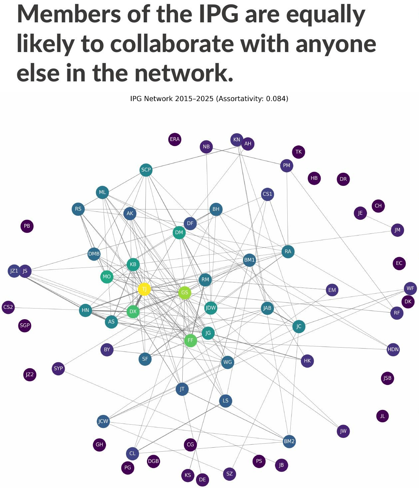
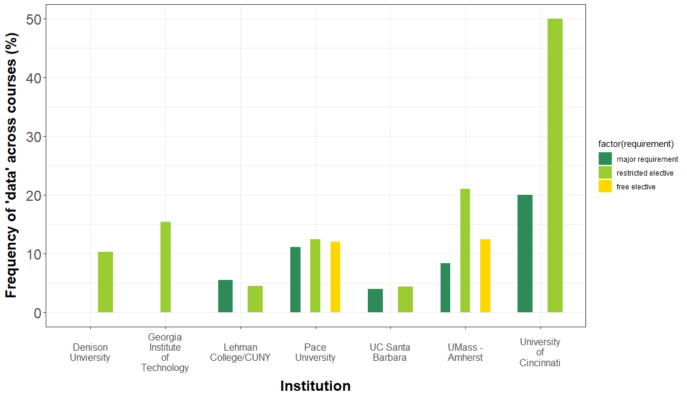

```{r setup, include=FALSE}
library(knitr)
library(magrittr)
genes = c('GLYMA_17G195900', 'GLYMA_05G092200')
options(htmltools.dir.version = FALSE)
knitr::opts_chunk$set(echo = FALSE)
knitr::opts_chunk$set(fig.align = 'center')
```

background-image: url("../../demat/figs/fam9_3.png")
background-size: 100px
background-position: 98% 2%

# About me: From MX to MI to MO at MU

## I work across multiple disciplines and countries

.left-column[

]

.right-column[
- 2013 - 2018 : Licenciatura (Bachelor): Mathematics @ Universidad de Guanajuato and CIMAT. 

- 2018 - 2023 : PhD: Computational Mathematics, Science &amp; Engineering @ Michigan State University 

- 2023 - 2025 : ~~PFFFD~~ ~~PFFIE~~ PFF Postdoctoral Fellow: Plant Science / Mathematics @ University of Missouri (MU).

- 2025 - present: Assistant Professor: Plant Science / Math @ MU. 
]

# Quantifying the intuition  Intuifying the quantities

---

# Come for the math, stay for the plants

<div class="row" style="font-family: 'Yanone Kaffeesatz'; font-size:22px;">
  <div class="column" style="max-width:33%">
    <p style="line-height:0;text-align: center; font-size:28px">The shape of adaptability</p>
    </img>
    </img>
    <p style="text-align: center;">Topological Data Analysis</p>
    <p style="text-align: center;">Euler Characteristic Transform</p>
  </div>
  <div class="column" style="max-width:33%">
    <p style="line-height:0;font-size:28px;text-align: center;">The shape of development</p>
    </img>
    </img>
    <p style="text-align: center;">Ellipsoidal modeling</p>
    <p style="text-align: center;">Directional statistics</p>
  </div>
  <div class="column" style="max-width:33%">
    <p style="line-height:0;font-size:28px;text-align: center;">The shape of domestication</p>
    </img>
    </img>
    <p style="text-align: center;">Allometry of multiple tissues</p>
    <p style="text-align: center;">Convexity indices</p>
  </div>
</div>

---

# Phenotyping the shape of things to come

<div class="row" style="font-family: 'Yanone Kaffeesatz'; font-size:22px;">
  <div class="column" style="max-width:33%">
    <p style="line-height:0;text-align: center; font-size:28px"><mark>Phenotyping patterns</mark></p>
    </img>
    </img>
    <p style="text-align: center;">mRNA sub-cellular localization in soybean nodule cells.</p>
  </div>
  <div class="column" style="max-width:33%">
    <p style="line-height:0;font-size:28px;text-align: center;">Phenotyping movement</p>
    </img>
    </img>
    <p style="text-align: center;">Tracking and describing <i>Cuscuta campestris</i> circumnutation</p>
  </div>
  <div class="column" style="max-width:33%">
    <p style="line-height:0;font-size:28px;text-align: center;"><mark>Phenotyping data</mark></p>
    </img>
    </img>
    <p style="text-align: center;">Reducing <strong>and</strong> clustering high-dimensional omics data</p>
  </div>
</div>

---


class: inverse, middle, center

# Phenotyping patterns

## How *pattern-y* is a pattern?

```{r, out.width=650, fig.align='center'}
knitr::include_graphics('../../mcarto/figs/sutton_etal_2025.png')
```


---

# mRNA localization at a sub-cellular level

- **Beyond gene expression counts**: Spatial segregation and asymmetrical distribution of mRNA across the cytosol in the soybean nodule.

- Molecular Cartography&trade; data provided by the Libault Lab

.pull-left[

Infected soybean nodule cells. Glyma.05G092200 in green. Glyma.05G216000 in red.
]

.pull-right[

**Goals**: "How patterny is a pattern?"

- Quantify the spatial patterns followed by mRNA within individual cells.
- Mathematically model all observed mRNA sub-cellular distributions.
- *Use this mathematical model to differentiate cell types and genotypes.*

**Challenge**

- Develop a mathematical model that works for any cell size, orientation, shape, and dimension.

]

---

# Same expression levels, different patterns


**Subcellular transcript patterns &harr; spatial location of the cell within the nodule**

---

background-image: url("../../mcarto/figs/GLYMA_05G092200_TDA_c00282_122.png")
background-size: 800px
background-position: 50% 85%

# KDEs &oplus; Sublevel sets &oplus; Pers. images

---

background-image: url("../../mcarto/figs/bw25_scale32_-_PI_1_1_1_H1+2_cell_sample.png")
background-size: 620px
background-position: 75% 99%

# PCA on all topological descriptors

```{r, out.width=350, fig.align='left'}
knitr::include_graphics(c('../../mcarto/figs/bw25_both_scale16_-_PI_1_1_1_pca_H1+2_gridded.png'))
```

---

background-image: url("../../mcarto/figs/bw25_scale32_-_PI_1_1_1_H1+2_kde_sample.png")
background-size: 620px
background-position: 99% 50%

.left-column[

# PC 1
- Related to the number of distinct hotspots
- Correlated to transcript number and cell size

# PC 2
- Related to the heterogeneity of hotspots
- Correlated to transcript density

]

---

# Connecting PC 02 to the biological context


- Senescent cells exhibit a distinct transcriptomic spatial pattern compared to the rest of population.
- Loss of mRNA localization may be a lesser known contributor to cell senescence.

---

# We define a morphospace of transcriptomic patterns


# We then work "backward"

---

class: bottom

background-image: url("../../mcarto/figs/scale32_-_PI_1_1_1_H1+2_synthetic_varclusters.jpg")
background-size: 900px
background-position: 50% 1%

```{r, out.width=600}
knitr::include_graphics(c('../../mcarto/figs/scale32_-_PI_1_1_1_H1+2_synthetic_pca_varclusters.jpg'))
```

---

# Gerrymandering tears and battlefields

.pull-left[

```{r, out.width=220, fig.align='center'}
knitr::include_graphics(c('../../tda/figs/025-imperial.png', 
                          '../../tda/figs/107-tulare.png',
                          '../../psd/figs/pavement_plasma.jpg'))
```


(w/Colin Nichols and Tyler Mitts)

]

.pull-right[


Spatial transcriptomics of a battlefield

]


---

class: inverse, middle, center

# Phenotyping data

## The shape of omics data and molecular biology

```{r, out.width=750, fig.align='center'}
knitr::include_graphics('../../nasrin/figs/amezquita_etal_2023.png')
```


---

background-image: url("../../nasrin/figs/mapper_vs_tsne_half.png")
background-size: 450px
background-position: 10% 90%


# Problem: Data is very high-dimensional

- FPKM counts of RNAseq data from human lung tissue &rarr; 19,648 genes
    - 314 healthy samples (GTEx)
    - 500 cancerous samples (TCGA)

- tSNE (or UMAP) separates healthy vs cancerous samples (blue vs red)
   
.pull-right[

**Question**: 

"Is the RNAseq data arranged into a specific shape?"

- Are there subgroups that we are ignoring?
- Can we go from clusters to continua?
- What is the biological characterization of such continua?

]

---

background-image: url("../../tda/figs/mapper_b_00.svg")
background-size: 725px
background-position: 50% 95%

# Mapper 

## Topological summary: exploration and visualization

- We start with **lots** of data points in a **high-dimensional** space.

- We want just a **handful** of points in a **low-dimensional** space that roughly preserve the original **shape**.

---

background-image: url("../../tda/figs/mapper_c_complete.svg")
background-size: 525px
background-position: 50% 99%

# Mapper in a single picture

---

# Mapper and lung cancer data

.pull-left[


]

.pull-right[
- Mapper produced mostly strand-like graphs regardless of parameters used

- Healthy subjects tend to stay at the center

- Cancerous samples are distributed at both ends

- Healthy subjects that land in between might be at risk

- **Predictive model**: Take a new patient sample and you can assess its cancer risk based on where they land in this continuum.
]

---

# Biological significance


---

background-image: url("../../nasrin/figs/rice_mapper_2025-11-20.png")
background-size: 905px
background-position: 50% 90%

# Leading the Resistance with mapper

- RNASeq data from rice samples: control and bacterial infection
- w/ Olivia Fisk and Gloria Asare


---

class: inverse, center, middle

# Other related research interests

.pull-left[

**Studying the people that study plants**
w/ Sophia Knehans and Roberto Herrera
]

.pull-right[
**The landscape of data science education in biology programs**



]


---

background-image: url("https://upload.wikimedia.org/wikipedia/commons/4/4a/University_of_Missouri_logo.svg")
background-size: 60px
background-position: 99% 1%

class: inverse

## Thank you!

.pull-left[

**Barley seeds &oplus; ECT**

- Liz Munch
- Dan Chitwood
- Michelle Quigley
- Tim Ophelders
- Jacob Landis
- Dan Koenig

**mRNA sub-cellular localization**

- Sutton Tennant
- Sandra Thibivillers
- Sai Subhash
- Benjamin Smith
- Samik Bhattacharya
- Jasper Kläver
- Marc Libault

**Mapper for lung cancer**

- Farzana Nasrain
- Katie Storey
- Masato Yoshizawa


]

.pull-right[

**Collaboration of the IPG network**

- Ethan Lenhardt
- Sophia Knehans
- Roberto Herrera
- David Braun

**Other ongoing TDA projects**

- Laura Martins
- Mather Khan
- David Mendoza-Cozatl
- Jie Zhu
- Felix Fritschi
- Jose Costa Netto
- Tim Duff
- Olivia Fisk
- Gloria Asare
- Ajay Gupta
- Bing Yang
- Tyler Mitts
- Colin Nichols


**More details**

<p style="font-size: 20px; text-align: center; color: Blue;">ejamezquita.github.io/</p>
<p style="font-size: 20px; text-align: center; color: Blue;">eah4d@missouri.edu</p>

]


