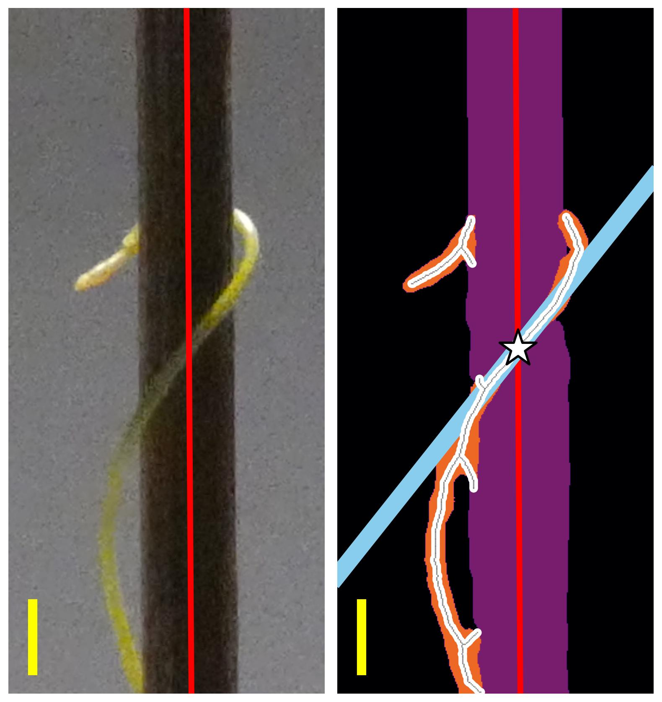
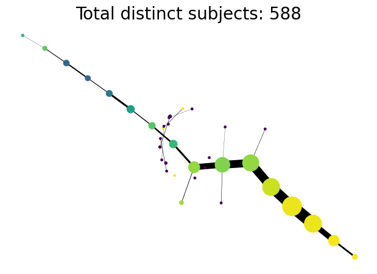

background-image: url("../../demat/figs/fam9_3.png")
background-size: 100px
background-position: 98% 2%

# About me: From MX to MI to MO at MU

## I work across multiple disciplines and countries

.left-column[

]

.right-column[
- 2013 - 2018 : Licenciatura (Bachelor): Mathematics @ Universidad de Guanajuato and CIMAT. Thesis focused on Topological Data Analysis applied to archaeology.

- 2018 - 2023 : PhD: Computational Mathematics, Science, and Engineering @ Michigan State University. Dissertation: Exploring the mathematical shape of plants. **Came for the math. Stayed for the plants.**

- 2023 - Present : PFFIE Postdoctoral Fellow @ Division of Plant Science & Technology (80%) / Department of Mathematics (20%) at MU.
]

              

---

# My work: Crossing and merging bridges

  

    
  

  

    
  

  

    
  

  

    
  

  

    
    
  

  

    
  

  

    
  

    <ul>
      <li>M Bentelspacher, <strong>EJA</strong>, S Adhikari, J Barros, SY Park (2024) "The early dodder gets the host: Decoding the coiling patterns of Cuscuta campestris with automated image processing". <em>Plant Cell Reports</em>.</li>
      <li><strong>EJA</strong>, MY Quigley, PJ Brown, E Munch, DH Chitwood (2024) "Allometry and volumes in a nutshell: Analyzing walnut morphology using three-dimensional X-ray computed tomography". <em>The Plant Phenome J</em>.</li>
      <li><strong>EJA</strong>, F Nasrin, KM Storey, M Yoshizawa (2023) "Genomics data analysis via spectral shape and topology." <em>PLOS One</em></li>
      <li>SA Cervantes-Pérez <em>et al.</em> (2024) "Tabula Glycine: The whole-soybean single-cell resolution transcriptome atlas." Submitted.</li>
      <li>Z Ji, <strong>EJA</strong>, L Newton, DH Chitwood, AM Thompson (2024) "From hand measurements to high throughput phenotyping: understanding maize canopy structure and predicting yield." Submitted.</li>
    </ul>

---

## PLNT_SCI 2500: Python taught for life sciences

<iframe width="800" height="550" src="../../tutorials/plnt_2500/Day-10_In-Class_NumPyDataAnalysis2-INSTRUCTOR.html" title="Day10">
</iframe>

---

## PLNT_SCI 2500: Active learning, example driven

<iframe width="800" height="550" src="../../tutorials/plnt_2500/Day-13_In-Class_Regression-INSTRUCTOR.html" title="Day10">
</iframe>

---

## PLNT_SCI 2500: With data from DPST faculty!

<iframe width="800" height="550" src="../../tutorials/plnt_2500/Day-20_In-Class_AdvancedPlotting-INSTRUCTOR.html" title="Day10">
</iframe>

---

background-image: url("https://www.biorxiv.org/content/biorxiv/early/2022/09/09/2022.09.07.506951/F1.large.jpg?width=800&height=600&carousel=1")
background-size: 325px
background-position: 1% 60%

# Discussion and future goals

**PLNT_SCI 2500: Data Science for Life Sciences I will be the first course for the emerging Data Science for Life Sciences Certificate**

- Incorporate examples from outside Plant Science to appeal to more students

- Data Science for Life Sciences II will build on top more Data Science topics:
    - Supervised and unsupervised classification
    - Clustering algorithms
    - Non-linear regressions
    - Network analyses
    - Statistical paradoxes to be wary of
    
**Professional Goal: Make the teaching of data science in life sciences a scientific endeavor in itself**

- Collaborate with colleagues with experience in Education research.

- Motivate students to tackle *and publish* a single research problem as a unit.

## Get in touch: ``eah4d@missouri.edu``
