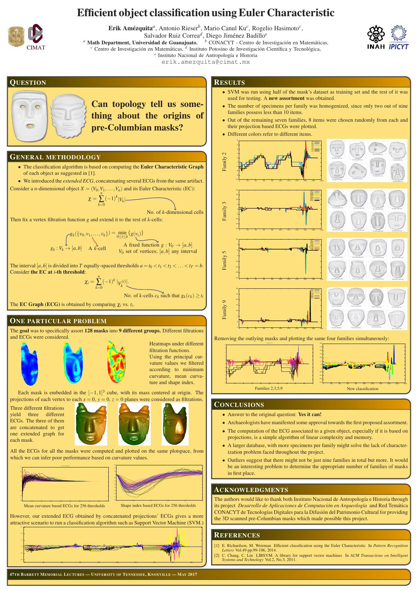
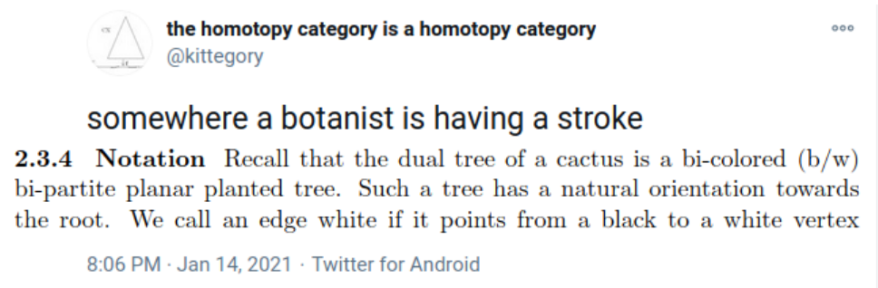
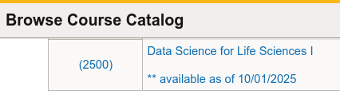

```{r setup, include=FALSE}
library(knitr)
library(magrittr)
genes = c('GLYMA_17G195900', 'GLYMA_05G092200')
options(htmltools.dir.version = FALSE)
knitr::opts_chunk$set(echo = FALSE)
knitr::opts_chunk$set(fig.align = 'center')
```

background-image: url("../../demat/figs/fam9_3.png")
background-size: 100px
background-position: 98% 2%

# About me: From MX to MI to MO at MU

## I work across multiple disciplines and countries

.left-column[

]

.right-column[
- 2013 - 2018 : Licenciatura (Bachelor): Mathematics @ Universidad de Guanajuato and CIMAT. Thesis focused on Topological Data Analysis applied to archaeology.

- 2018 - 2023 : PhD: CMSE @ MSU. Dissertation: Exploring the mathematical shape of plants. 
- 2023 - 2025 : ~~PFFFD~~ ~~PFFIE~~ PFF Postdoctoral Fellow: Plant Science (80%) / Mathematics (20%) @ University of Missouri (MU).

- 2025 - present: Assistant Professor: Plant Science (100%) / Math (0%) @ MU. 
]

---

background-image: url("../../barley/figs/seed.png")
background-size: 325px
background-position: 99% 99%

class: middle

# Roadmap for today

1. My research before CMSE 
   - Mixing TDA (Topological Data Analysis) with archaeology

1. My research while at CMSE
   - Mixing TDA with plant biology

1. My research right after CMSE
   - Jack of all trades, master of none

1. Current projects that excite me
   - Taking a leaf from CMSE 201

---

background-image: url("../../img/cmse_logo.svg")
background-size: 300px
background-position: 50% 45%

class: inverse, center, middle

# A mathematician by training, a data scientist by trade, and a plant biologist by ~~collaboration~~ osmosis

<p style="opacity:0">a<br>aa<br>aa<br>aa<br>aa<br>aa<br>a</p>

```{r, out.width=400}
knitr::include_graphics("https://png.pngtree.com/png-vector/20220617/ourmid/pngtree-diagram-showing-osmosis-in-plant-cell-natural-education-plants-vector-png-image_37088024.png")
```

---

background-image: url("../../demat/figs/ecg_results.png")
background-size: 700px
background-position: 50% 80%

# 2017: Pre-CMSE &rarr; TDA &oplus; Archaeology

Topological Data Analysis for pre-Columbian mask classification

--

.pull-left[

```{r, out.width=310}

```
]

--

.pull-right[


```{r, eval=FALSE, echo=TRUE}
*- Lessons learned for better 
* future interdisciplinary 
* collaborations
  
*- Always include the other
* discipline experts at
* every stage of the analysis

```
]

---

background-image: url("../../arabidopsis/figs/PFig1.png")
background-size: 900px
background-position: 50% 70%

# 2018: CMSE &rarr; TDA &oplus; Plant Biology

Mathematically quantify the shape of plants with Liz Munch and Dan Chitwood

--

.pull-left[

```{r, out.width=500}

```
]

.pull-right[


]

---

# Come for the math, stay for the plants

<div class="row" style="font-family: 'Yanone Kaffeesatz'; font-size:22px;">
  <div class="column" style="max-width:33%">
    <p style="line-height:0;text-align: center; font-size:28px">The shape of adaptability</p>
    </img>
    </img>
    <p style="text-align: center;">Topological Data Analysis</p>
    <p style="text-align: center;">Euler Characteristic Transform</p>
  </div>
  <div class="column" style="max-width:33%">
    <p style="line-height:0;font-size:28px;text-align: center;">The shape of development</p>
    </img>
    </img>
    <p style="text-align: center;">Ellipsoidal modeling</p>
    <p style="text-align: center;">Directional statistics</p>
  </div>
  <div class="column" style="max-width:33%">
    <p style="line-height:0;font-size:28px;text-align: center;">The shape of domestication</p>
    </img>
    </img>
    <p style="text-align: center;">Allometry of multiple tissues</p>
    <p style="text-align: center;">Convexity indices</p>
  </div>
</div>

---

class: inverse, middle, center

# 2023: Post-CMSE &rarr; Math &oplus; Plants

## It is far easier to switch countries than to switch disciplines

## But CMSE trained me for the cultural shock


```{r, out.width=500}

```

<p style="font-size: 10px; text-align: center; color: Grey;">Credits: <a href="http://dx.doi.org/10.2140/agt.2005.5.237">Kaufmann (2005)</a></p>


---

# Tracking how a vegetarian plant wiggles

<video width="900" controls>
  <source src="../../cuscuta/video/9am_Inc_Rep_3_redone.mp4" type="video/mp4">
</video>

- *Cuscuta campestris* inoculated at different times of the day for 24h
- In collaboration with Soyon Park

---

## Phenotyping movement: how *wiggly* is a wiggle?
  
<video width="900" controls>
  <source src="../../cuscuta/video/4pm_rep7_plant_01.mp4" type="video/mp4">
</video>

- Mathematically model how *Cuscuta* moves under various environmental conditions to ultimately stop it from attaching to crops in the first place.


---

## Phenotyping patterns: How *patterny* is a pattern?


- Beyond gene expression counts: Spatial segregation and asymmetrical distribution of mRNA across the cytosol in the soybean nodule.
- Molecular Cartography&trade; data provided by the Libault Lab

---

## Topological Data Analysis to quantify our intuition


---


background-image: url("../../mcarto/figs/scale32_-_PI_1_1_1_H1+2_synthetic_30_clusters.jpg")
background-size: 900px
background-position: 50% 80%

## Define a morphospace of transcriptomic patterns

--

<p style="opacity:0">a<br>aa<br>aa<br>aa<br>aa<br>aa<br>aaa<br>aa<br>a</p>

```{r, out.width=600}
knitr::include_graphics(c('../../mcarto/figs/scale32_-_PI_1_1_1_H1+2_synthetic_pca_30_clusters.jpg'))
```

---

background-image: url("../../tutorials/figs/mizzou_math_drp.png")
background-size: 250px
background-position: 99% 1%

## More data, more shapes, more phenotyping

.pull-left[

Academic social network analysis of the IPG (Interdisciplinary Plant Group)

```{r, out.width=300, fig.align='center'}

```

Similar work to be done with gene coexpression and biota interaction networks.

]

.pull-right[

Use TDA to analyze geographical patterns across the state.

<p style="font-size: 10px; text-align: center; color: Grey;">Credits: <a href="https://doi.org/10.1137/19M1241519">Feng and Porter (2021)</a></p>

```{r, out.width=180, fig.align='center'}
knitr::include_graphics(c('../../tda/figs/025-imperial.png',
                      'https://www.researchgate.net/publication/362833654/figure/fig2/AS:11431281098979080@1669173266225/Two-persistence-diagrams-for-the-simulation-shown-in-Fig-1-The-blue-crosses-represent.png', '../../psd/figs/pavement_plasma.jpg'))
```


A voting district looks like a plant cell. 

]

---

background-image: url("https://plantsandpython.github.io/PlantsAndPython/_images/plants_python_logo.jpg")
background-size: 180px
background-position: 99% 1%

class: inverse, center, middle

# Shaping the next generation of interdisciplinary scientists

## Large amounts of data require large amounts of people

## PLNT_SCI 2500: Data Science for Life Sciences I



---

## Taking a leaf from CMSE 201 

<p align="center">
<iframe width="800" height="550" src="../../tutorials/plnt_2500/Day-13_In-Class_Regression-INSTRUCTOR.html" title="Day10">
</iframe>
</p>

---

## PLNT_SCI 2500: With data from Missouri faculty!

<p align="center">
<iframe width="800" height="550" src="../../tutorials/plnt_2500/Day-20_In-Class_AdvancedPlotting-INSTRUCTOR.html" title="Day10">
</iframe>
</p>

---

# The shape of things to come

.left-column[


]

.right-column[

- Make the teaching of data science in life sciences a scientific endeavor in itself.

- More **translations** of Topological Data Analysis and other mathematical techniques to quantify plant biology-inspired data

- Explore more applications of complex network theory to biology and meta-biology contexts.

**Adverstisement**

- I will be looking for PhD students to start next year working with me at the intersection of math, data science, and plant science
]

```{r, out.width=500, fig.align='center'}
knitr::include_graphics('https://gradschool.missouri.edu/wp-content/uploads/2019/02/MU_UnitSig_GraduateSchool_rgb_std_horiz.png')
```

---

background-image: url("https://upload.wikimedia.org/wikipedia/commons/4/4a/University_of_Missouri_logo.svg")
background-size: 60px
background-position: 99% 1%

class: inverse

## Thank you!

.pull-left[

**Research while at CMSE**

- Liz Munch
- Dan Chitwood
- Michelle Quigley
- Tim Ophelders
- Jacob Landis
- Dan Koenig
- Danelle Seymour
- Pat Brown

**Cuscuta rhythm and locomotion**

- Max Bentelspacher
- Supral Adhikari
- Jaime Barros-Rios
- Joseph Lynch
- So-Yon Park

**mRNA sub-cellular localization**

- Sutton Tennant
- Sandra Thibivillers
- Sai Subhash
- Benjamin Smith
- Samik Bhattacharya
- Jasper Kläver
- Marc Libault

]

.pull-right[

**Collaboration of the IPG network**

- Ethan Lenhardt
- Sophia Knehans
- Roberto Herrera
- David Braun

**Data Science for Life Sciences I**

- Kent Shannon
- Andrew Scaboo
- Jianfeng Zhou
- Debbie Finke

**Other ongoing projects**

- Leyre Urmeneta
- Laura Martins
- Mather Khan
- David Mendoza-Cozatl
- Jie Zhu

**More details**

<p style="font-size: 20px; text-align: center; color: Blue;">ejamezquita.github.io/</p>
<p style="font-size: 20px; text-align: center; color: Blue;">eah4d@missouri.edu</p>

]


