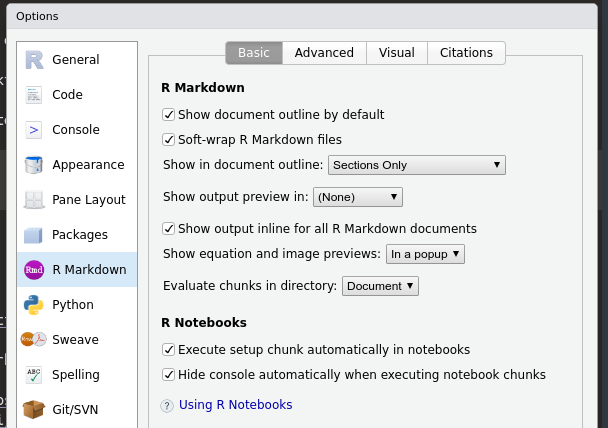
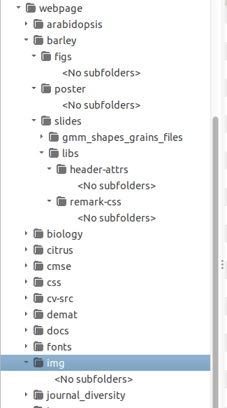
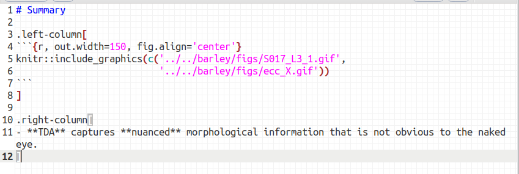
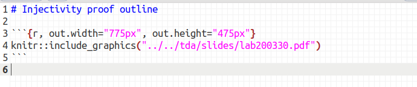
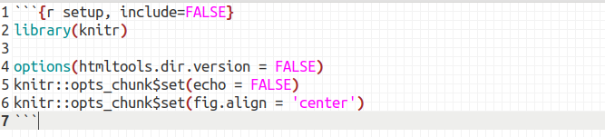

```{r setup, include=FALSE}
library(knitr)

options(htmltools.dir.version = FALSE)
knitr::opts_chunk$set(echo = FALSE)
knitr::opts_chunk$set(fig.align = 'center')
```

# Xaringan: The best of both worlds

.pull-left[
**RMarkdown Based**

- What you see is what you mean, just like beamer.

- Markdown: Much easier to type basic text formatting and hyperlinks.

- [remark](https://remarkjs.com/#1) with $\LaTeX$ and R support.

- It might take a while to make your first slide deck, but once you are done, you can easily copy/paste.

- Adding new images won't throw everything awry*.
]

.pull-right[
**HTML Powered**

- Immediate to share with everyone

- Add easily GIFs, videos, PDFs, other websites, etc.

- Only one copy per image for all presentations

- Or even refer to the online images/videos/etc 

- You might need to learn some CSS/HTML hacks along the way

- Forces you to have a nice website (now that I'm graduating, I'll have to find a nice webhost service.)
]

---

# How I planned this tutorial

- **Disclaimer**: I quickly put this together without prior notice.

- I'll show a variety of my own slides and then the actual important bits of code behind them.

- Formatting options are limited in xaringan, but with some creative thinking you can get around most of the limitations.

- [Yihue Xie](https://yihui.org/) wrote xaringan because he found beamer too boring and powerpoint too painful.

```{r, out.width=250}
knitr::include_graphics("https://64.media.tumblr.com/3a2e9098536ce810065e22879b71a049/tumblr_nqiz97ahPZ1tlb56zo1_400.gifv")
```
<p style="font-size: 24px; text-align: center; font-family: 'Yanone Kaffeesatz'">Me finding out about xaringan early during the pandemic</p>

---

# Getting started

- Make sure you have the most updated version of [R](https://cran.r-project.org/) and [RStudio](https://posit.co/products/open-source/rstudio/)

- In principle you can use any IDE, but RStudio is fine-tuned to make RMarkdown writing much easier.

- Install the [rmarkdown](https://rmarkdown.rstudio.com/), [pagedown](https://pagedown.rbind.io/), [bookdown](https://bookdown.org/), [knitr](https://yihui.org/knitr/), and [xaringan](https://github.com/yihui/xaringan) packages.

- All of them can be easily installed through CRAN (highly recommended)

- Disable the RStudio RMarkdown viewer (IMO it is more annoying than useful).

- I rather have my slides open in a web browser and reload constantly to see changes.

```{r, out.width=350}

```

---

# MWE: Minimum Working Example

.left-column[

]

.right-column[
- Unpack the [zip with toy files](../xaringan_2023.zip), which includes the source code of this very slides.

- &larr; I keep my website files ordered like this

- Feel free to use this [Rmd file](xaringan_2023.Rmd) as your template for future endeavors

- From the zip, open `xaringan -> slides -> xaringan_2023.Rmd` with RStudio

- Knit it with `Ctrl + K` and off you go!
]

---

background-image: url("../../img/cat_error.webp")
background-size: 100px
background-position: 99% 1%

class: inverse, middle, center

# Just show us the code already!

## Alright


---

# The previous slide

<hr>
```
background-image: url("../../img/cat_error.webp")
background-size: 100px
background-position: 99% 1%

class: inverse, middle, center

# Just show us the code already!

## Alright


```
<hr>

- Include a background image (you can only have at most one per slide)

- Define the `class` of the slide: 
    - `left` (default), `center`, `right` for horizontal alignment
    - `top` (default), `middle`, `bottom` for vertical alignment
    - `inverse` for inverted color scheme

---

# The previous (previous) slide

<hr>
```
background-image: url("../../img/cat_error.webp")
background-size: 100px
background-position: 99% 1%

class: inverse, middle, center

# Just show us the code already!

## Alright


```
<hr>

- `#`, `##`, `###` for headings, subheadings, and subsubheadings as in markdown

- Include images with ``

- Use `-`, `+`, or `*` for unlisted bullet points

- Use `1.`, `1.`, `1.` for numbered bullet points

---

background-image: url("../../barley/figs/ecc_ver2.gif")
background-size: 750px
background-position: 50% 90%

## The Euler Characteristic Curve (ECC)

- Consider a cubical complex $X\subset\mathbb{R}^d$
- And a unit-length direction $\nu\in S^{d-1}$

- And the subcomplex containing all cubical cells below height $h$ in the direction $\nu$
$$X(\nu)_h =\{\Delta \in X\::\:\langle x,\nu\rangle\leq h\text{ for all }x\in\Delta\}$$

- The Euler Characteristic Curve (ECC) of direction $\nu$ is defined as the sequence $$\{\chi(X(\nu)_h)\}_{h\in\mathbb{R}}$$

---

```
background-image: url("../../barley/figs/ecc_ver2.gif")
background-size: 750px
background-position: 50% 90%

## The Euler Characteristic Curve (ECC)

- Consider a cubical complex $X\subset\mathbb{R}^d$
- And a unit-length direction $\nu\in S^{d-1}$

- And the subcomplex containing all cubical cells below height $h$ in the direction $\nu$
$$X(\nu)_h =\{\Delta \in X\::\:\langle x,\nu\rangle\leq h\text{ for all }x\in\Delta\}$$

- The Euler Characteristic Curve (ECC) of direction $\nu$ is defined as the sequence $$\{\chi(X(\nu)_h)\}_{h\in\mathbb{R}}$$
```
<hr>

- Include $\LaTeX$ code with either `$` (as usual) or `\(` and `\)`

- Ignore the backticks in the verbatim above.

- Include links with `[to show](actual/url/or/path/to/link)`

---

# More on the ECT

--

- Easy to compute: a quick alternating sum.

--

- *Different* simplicial complexes correspond to *different* ECTs.

--

- [**Theorem _(ibid)_**](https://arxiv.org/abs/1310.1030): The ECT effectively summarizes all possible information related to shape.

---

```
---

# More on the ECT

--

- Easy to compute: a quick alternating sum.

--

- *Different* simplicial complexes correspond to *different* ECTs.

--

- [**Theorem _(ibid)_**](https://arxiv.org/abs/1310.1030): The ECT effectively summarizes all possible information related to shape.
---

```
<hr>

- Define new slides with `---`

- Make a slide pause with `--`

- Beware of trailing blank spaces

---

# Summary

.left-column[
```{r, out.width=150, fig.align='center'}
knitr::include_graphics(c('../../barley/figs/S017_L3_1.gif', '../../barley/figs/ecc_X.gif'))
```
]

.right-column[
- **TDA** captures **nuanced** morphological information that is not obvious to the naked eye.
]

---



<hr>

- Make a 25/75 split with `.left-column` and `.right-column`

- You **cannot** control image width/height with ``. Use an RMarkdown code chunk instead.

- Start and close a chunk with `3` backticks

- Curly braces to indicate `R` code and other format parameters

- Include the image(s) with `knitr::include_graphics(c(path1,path2,...))`

- Surround text with `*` for italics, `**` to bold

---

# Plants & Python *a la* Mizzou

.pull-left[

]

.pull-right[
- **Inspired by the current Plants & Python course @ MSU**

- Offered in hybrid format between &rarr;MSU and UNAM&larr;
]

---

```
# Plants & Python *a la* Mizzou

.pull-left[

]

.pull-right[
- **Inspired by the current Plants & Python course @ MSU**

- Offered in hybrid format between &rarr;MSU and UNAM&larr;
]
```
<hr>

- Make a 50/50 split with `.pull-left` and `.pull-right`

- You can include images/elements as URLs

- Add HTML symbols `&symbol;`. [List here](https://www.w3schools.com/charsets/ref_utf_symbols.asp). Make sure your web browser supports it.

- &#9742;, &#9736;, &#9775;, &#9781;, &#9822;, &#9851;, &#9940;, &#9978;

- `&#9742;, &#9736;, &#9775;, &#9781;, &#9822;, &#9851;, &#9940;, &#9978;`

---

background-image: url("https://plantsandpython.github.io/PlantsAndPython/_images/plants_python_logo.jpg")
background-size: 180px
background-position: 99% 1%

## Python taught especifically for plant biologists

<p align="center">
<iframe width="800" height="500" src="https://plantsandpython.github.io/PlantsAndPython/00_Opening_page.html" title="Plants and Python">
</iframe>
</p>
<p style="font-size: 8px; text-align: right; color: Grey;"><a href="https://plantsandpython.github.io/PlantsAndPython/00_Opening_page.html">Original link</a></p>

---

```
background-image: url("https://plantsandpython.github.io/PlantsAndPython/_images/plants_python_logo.jpg")
background-size: 180px
background-position: 99% 1%

## Python taught especifically for plant biologists

<p align="center">
<iframe width="800" height="500" src="https://plantsandpython.github.io/PlantsAndPython/00_Opening_page.html" title="Plants and Python">
</iframe>
</p>
<p style="font-size: 8px; text-align: right; color: Grey;"><a href="https://plantsandpython.github.io/PlantsAndPython/00_Opening_page.html">Original link</a></p>
```
<hr>

- Include a website as an iframe
- Keep in mind that not all websites allow iframe display

---

## Oil glands are closely linked to fruit development

.pull-left[

<p style="font-size: 8px; text-align: right; color: Grey;"> Credits: <a href="https://www.boredpanda.com/life-cycles-pics/">BoredPanda</a></p>

Developing cycle of a lemon
]

.pull-right[
<iframe width="560" height="300" src="https://static-movie-usa.glencoesoftware.com/webm/10.1073/956/d916befc88029defb1ecef6c4a2fd83db89428d9/pnas.1720809115.sm02.webm" frameborder="0" allowfullscreen></iframe>
<p style="font-size: 8px; text-align: right; color: Grey;"> Credits: <a href="https://doi.org/10.1073/pnas.1720809115">Smith <em>et al.</em> (2018)</a></p>

- Cross-sectional view of a navel orange peel bending to the point of jetting. 

- Huge perfume and food industry behind essential oils

]

---

```
## Oil glands are closely linked to fruit development

.pull-left[

<p style="font-size: 8px; text-align: right; color: Grey;"> Credits: <a href="https://www.boredpanda.com/life-cycles-pics/">BoredPanda</a></p>

Developing cycle of a lemon
]

.pull-right[
<iframe width="560" height="300" src="https://static-movie-usa.glencoesoftware.com/webm/10.1073/956/d916befc88029defb1ecef6c4a2fd83db89428d9/pnas.1720809115.sm02.webm" frameborder="0" allowfullscreen></iframe>
<p style="font-size: 8px; text-align: right; color: Grey;"> Credits: <a href="https://doi.org/10.1073/pnas.1720809115">Smith <em>et al.</em> (2018)</a></p>

- Cross-sectional view of a navel orange peel bending to the point of jetting. 

- Huge perfume and food industry behind essential oils

]
```
<hr>

- iframes can also be used to display online `mp4` and `webv` video files.

---

# Injectivity proof outline

```{r, out.width="775px", out.height="475px"}
knitr::include_graphics("../../tda/slides/lab200330.pdf")
```

---


<hr>

- Include PDFs with `knitr::include_graphics`

---

# The title slide

```
title: "Making slides in xaringan"
subtitle: "The best of both worlds"
author: "**Erik Amézquita** <br> &mdash; <br> Computational Mathematics, Science, and Engineering <br> Michigan State University <br> &mdash;"
date: "`r Sys.Date()`"
output:
  xaringan::moon_reader:
    css: ["../../css/msu.css", default-fonts, "../../css/gallery.css"]
    chakra: '../../js/remark-latest.min.js'
    lib_dir: libs
    nature:
      highlightStyle: github
      highlightLines: true
      countIncrementalSlides: false
```
<hr>

- I don't remember what most of the options do exactly

- You can add your own `css` file. The `msu.css` is a modification of another xaringan CSS with MSU colors.

---

## Include this right after your title slide



<hr>

- Load `knitr` (not necessary if you always do `knitr::`)

- I don't remember what `htmltools.dir.version` does

- `echo = FALSE` will make sure `knitr` doesn't print R console output into the slide by default.

- You can set that all R chunk outputs will be centered by default.

- Cheatsheet for [rmarkdown](https://raw.githubusercontent.com/rstudio/cheatsheets/main/rmarkdown-2.0.pdf) `R` chunk options

---

class: inverse, middle, center

# My main gripe: arrays of images

## Things are about to get dirty with HTML/CSS

Look at the [`gallery.css`](../../css/gallery.css) (or don't and just use it)

---

background-image: url("../../barley/figs/S017_L0_seed_10_0.gif")
background-size: 85px
background-position: 90% 2%

# Traditional shape descriptors

<div class="row">
  <div class="column" style="max-width:55%">
    </img>
    </img>
  </div>
  <div class="column" style="max-width:45%">
    </img>
    </img>
    </img>
  </div>
</div>

---

```
background-image: url("../figs/S017_L0_seed_10_0.gif")
background-size: 85px
background-position: 90% 2%

# Traditional shape descriptors

<div class="row">
  <div class="column" style="max-width:55%">
    </img>
    </img>
  </div>
  <div class="column" style="max-width:45%">
    </img>
    </img>
    </img>
  </div>
</div>
```
<hr>

- Use `row` and `column` divs to get arbitary splits
- I've spent a good chunk of my time fiddling with the right `max-width` values
- Include images with `</img>`
- Tweak the image format with [standard CSS/HTML](https://www.w3schools.com/css/css3_images.asp)
- You can add text, youtube iframes, etc within the `div`

---

## Evolution in real time &rarr; X-rays &rarr; Image Processing

<div class="row" style="color: Navy; font-size: 15px;">
  <div class="column" style="max-width:41%;">
    </img>
    <p style="text-align: center;">28 accessions around the world</p>
  </div>
  <div class="column" style="max-width:50%;">
    </img>
    <p style="text-align: center;">58 generations in California</p>
  </div>
</div>

<div class="row" style="color: Navy; font-size: 15px;">
  <div class="column" style="max-width:51%;">
    </img>
    <p style="text-align: center;"> Proprietary X-Ray CT scan reconstruction </p>
  </div>
  <div class="column" style="max-width:17.5%;">
    </img>
    <p style="text-align: center;"> 975 spikes </p>
  </div>
  <div class="column" style="max-width:20.5%;">
    </img>
    <p style="text-align: center;"> 38,000 seeds </p>
  </div>
</div>

---

```
## Evolution in real time &rarr; X-rays &rarr; Image Processing

<div class="row" style="color: Navy; font-size: 15px;">
  <div class="column" style="max-width:41%;">
    </img>
    <p style="text-align: center;">28 accessions around the world</p>
  </div>
  <div class="column" style="max-width:50%;">
    </img>
    <p style="text-align: center;">58 generations in California</p>
  </div>
</div>

<div class="row" style="color: Navy; font-size: 15px;">
  <div class="column" style="max-width:51%;">
    </img>
    <p style="text-align: center;"> Proprietary X-Ray CT scan reconstruction </p>
  </div>
  <div class="column" style="max-width:17.5%;">
    </img>
    <p style="text-align: center;"> 975 spikes </p>
  </div>
  <div class="column" style="max-width:20.5%;">
    </img>
    <p style="text-align: center;"> 38,000 seeds </p>
  </div>
</div>
```

---

# Plant morphology

<div class="row">
  <div class="column" style="max-width:50%">
    <iframe width="375" height="210" src="https://www.youtube-nocookie.com/embed/oM9kAq0PBvw?controls=0" frameborder="0" allow="accelerometer; autoplay; encrypted-media; gyroscope; picture-in-picture" allowfullscreen></iframe>
    <iframe width="375" height="210" src="https://www.youtube-nocookie.com/embed/V39K58evWlU?controls=0" frameborder="0" allow="accelerometer; autoplay; encrypted-media; gyroscope; picture-in-picture" allowfullscreen></iframe>
  </div>
  <div class="column" style="max-width:50%">
    <iframe width="375" height="210" src="https://www.youtube-nocookie.com/embed/efF5PSvFQ2A?controls=0" frameborder="0" allow="accelerometer; autoplay; encrypted-media; gyroscope; picture-in-picture" allowfullscreen></iframe>
    <iframe width="375" height="210" src="https://www.youtube-nocookie.com/embed/qkOjHHuoUhA?controls=0" frameborder="0" allow="accelerometer; autoplay; encrypted-media; gyroscope; picture-in-picture" allowfullscreen></iframe>
  </div>
</div>
<p style="font-size: 24px; text-align: right; font-family: 'Yanone Kaffeesatz'">Check out more 3D X-ray CT scans at <a href="https://www.youtube.com/@endlessforms6756">youtube.com/@endlessforms6756</a></p>

---

```
# Plant morphology

<div class="row">
  <div class="column" style="max-width:50%">
    <iframe width="375" height="210" src="https://www.youtube-nocookie.com/embed/oM9kAq0PBvw?controls=0" frameborder="0" allow="accelerometer; autoplay; encrypted-media; gyroscope; picture-in-picture" allowfullscreen></iframe>
    <iframe width="375" height="210" src="https://www.youtube-nocookie.com/embed/V39K58evWlU?controls=0" frameborder="0" allow="accelerometer; autoplay; encrypted-media; gyroscope; picture-in-picture" allowfullscreen></iframe>
  </div>
  <div class="column" style="max-width:50%">
    <iframe width="375" height="210" src="https://www.youtube-nocookie.com/embed/efF5PSvFQ2A?controls=0" frameborder="0" allow="accelerometer; autoplay; encrypted-media; gyroscope; picture-in-picture" allowfullscreen></iframe>
    <iframe width="375" height="210" src="https://www.youtube-nocookie.com/embed/qkOjHHuoUhA?controls=0" frameborder="0" allow="accelerometer; autoplay; encrypted-media; gyroscope; picture-in-picture" allowfullscreen></iframe>
  </div>
</div>
<p style="font-size: 24px; text-align: right; font-family: 'Yanone Kaffeesatz'">
  Check out more 3D X-ray CT scans at <a href="https://www.youtube.com/@endlessforms6756">youtube.com/@endlessforms6756</a>
</p>
```
<hr>

- Any YouTube video has an _embed_ option to get the right `iframe`.

- Use CSS/HTML `<p></p>` for specific text formatting.

- Use `<a></a>` for hyperlinks

---

## &darr; Before and After &rarr;

.left-column[

]

.right-column[
- 2013 - 2018 : Math @ at the Universidad de Guanajuato and CIMAT.

- 2016 - 2018 : Bachelor thesis: **Math + Archaeology**. Use TDA to quantify and classify the shape of pre-Columbian masks found in the Templo Mayor in Mexico City.

- 2018 - 2023 : CMSE @ MSU. **Came for the math. Stayed for the plants.**

- 2023 - ???? : PFFFD Postdoc Fellow @ Division of Plant Sciences at Mizzou in Columbia, MO
]

<p style="font-size:3px">&mdash;&mdash;&mdash;&mdash;&mdash;&mdash;&mdash;&mdash;&mdash;&mdash;&mdash;&mdash;&mdash;&mdash;&mdash;&mdash;&mdash;&mdash;&mdash;&mdash;&mdash;&mdash;&mdash;&mdash;&mdash;&mdash;&mdash;&mdash;&mdash;&mdash;&mdash;&mdash;&mdash;&mdash;&mdash;&mdash;&mdash;&mdash;&mdash;&mdash;&mdash;&mdash;&mdash;&mdash;&mdash;&mdash;&mdash;&mdash;&mdash;&mdash;&mdash;&mdash;&mdash;&mdash;&mdash;&mdash;&mdash;&mdash;&mdash;&mdash;&mdash;&mdash;&mdash;&mdash;&mdash;&mdash;&mdash;&mdash;&mdash;&mdash;&mdash;&mdash;&mdash;&mdash;&mdash;&mdash;&mdash;&mdash;&mdash;&mdash;&mdash;</p>

<div class="row">
  <div class="column" style="max-width:45%">
    
  </div>
  <div class="column" style="max-width:53%">
    
  </div>
</div>

---

```
## &darr; Before and After &rarr;

.left-column[

]
.right-column[
- 2013 - 2018 : Math @ at the Universidad de Guanajuato and CIMAT.
- 2016 - 2018 : Bachelor thesis: **Math + Archaeology**. Use TDA to quantify and classify the shape of pre-Columbian masks found in the Templo Mayor in Mexico City.
- 2018 - 2023 : CMSE @ MSU. **Came for the math. Stayed for the plants.**
- 2023 - ???? : PFFFD Postdoc Fellow @ Division of Plant Sciences at Mizzou in Columbia, MO
]

<p style="font-size:3px">&mdash;&mdash;&mdash;&mdash;&mdash;&mdash;&mdash;&mdash;&mdash;&mdash;&mdash;&mdash;&mdash;&mdash;&mdash;&mdash;&mdash;&mdash;&mdash;&mdash;&mdash;&mdash;&mdash;&mdash;&mdash;&mdash;&mdash;&mdash;&mdash;&mdash;&mdash;&mdash;&mdash;&mdash;&mdash;&mdash;&mdash;&mdash;&mdash;&mdash;&mdash;&mdash;&mdash;&mdash;&mdash;&mdash;&mdash;&mdash;&mdash;&mdash;&mdash;&mdash;&mdash;&mdash;&mdash;&mdash;&mdash;&mdash;&mdash;&mdash;&mdash;&mdash;&mdash;&mdash;&mdash;&mdash;&mdash;&mdash;&mdash;&mdash;&mdash;&mdash;&mdash;&mdash;&mdash;&mdash;&mdash;&mdash;&mdash;&mdash;&mdash;</p>

<div class="row">
  <div class="column" style="max-width:45%">
    
  </div>
  <div class="column" style="max-width:53%">
    
  </div>
</div>
```
<hr>

- You might need hacks when you mix and match

---

class: inverse, center, middle

# Additional resources

---

# Additional resources

- General [RMarkdown](https://bookdown.org/yihui/rmarkdown/) and [xaringan](https://bookdown.org/yihui/rmarkdown/xaringan-format.html) documentation.

- Or xaringan documentation as [xaringan slides](https://slides.yihui.org/xaringan/#1)

- Cheatsheet for [rmarkdown](https://raw.githubusercontent.com/rstudio/cheatsheets/main/rmarkdown-2.0.pdf) `R` chunk options

- W3schools has extensive and nicely explained CSS and HTML [tutorials](https://www.w3schools.com/css/default.asp)

- You can setup your personal website via [DECS](https://www.egr.msu.edu/decs/help-support/how-to/engineering_homepage_setup)

- Be *persistent*: First slide show might take you a week, but once you get a feeling for xaringan/CSS and your website folder structure, you'll spend at most a day preparing slides.

- For reference, I wrote this whole thing in 4h total

- (That's just to make the slides **after** I spent a few days making GIFs)

---

class: inverse, center, middle

# Questions?


