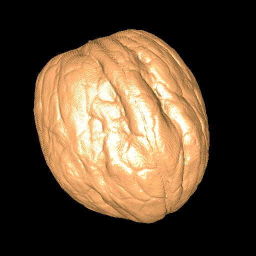
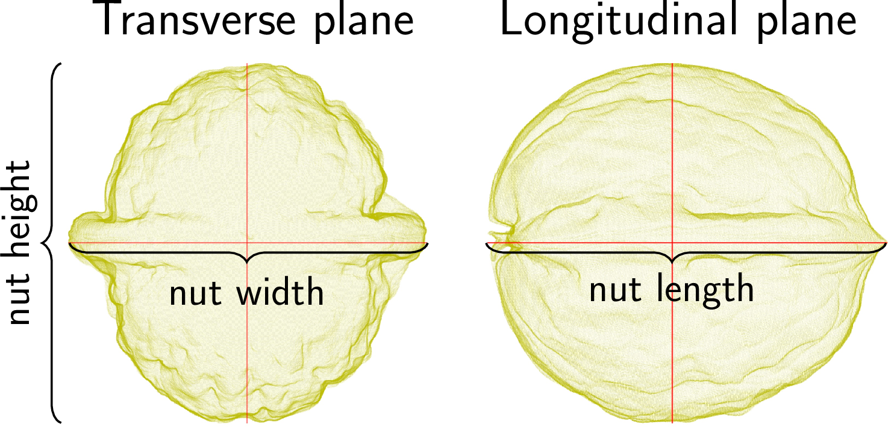
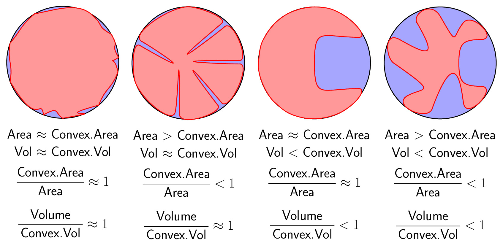
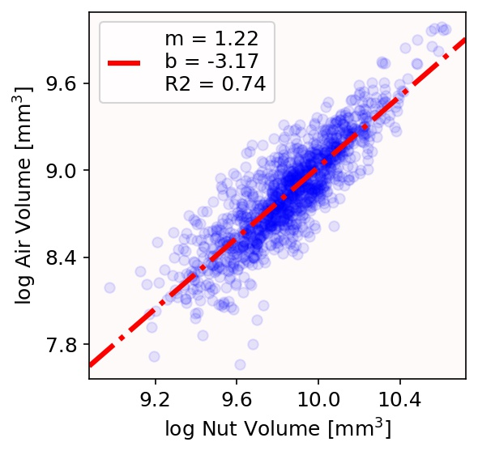
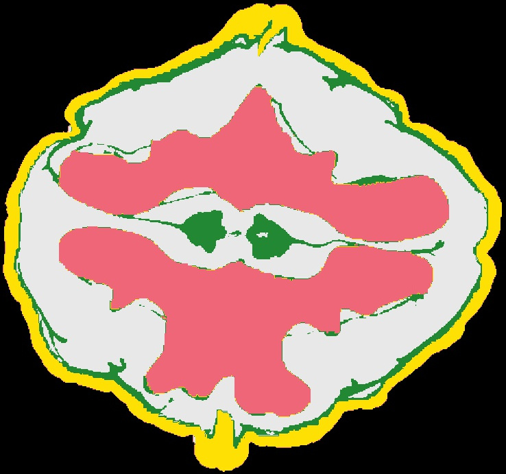

```{r setup, include=FALSE}
library(reticulate)
library(knitr)

options(htmltools.dir.version = FALSE)
knitr::opts_chunk$set(echo = FALSE)
knitr::opts_chunk$set(fig.align = 'center')
```

background-image: url("../../img/endlessforms.png")
background-size: 150px
background-position: 89% 7%

class: inverse

# Plant morphology

<div class="row">
  <div class="column" style="max-width:50%">
    <iframe width="375" height="210" src="https://www.youtube-nocookie.com/embed/Cr0B-yFcJZk?controls=0" frameborder="0" allow="accelerometer; autoplay; encrypted-media; gyroscope; picture-in-picture" allowfullscreen></iframe>
    <iframe width="375" height="210" src="https://www.youtube-nocookie.com/embed/ikhuvGpJbeA?controls=0" frameborder="0" allow="accelerometer; autoplay; encrypted-media; gyroscope; picture-in-picture" allowfullscreen></iframe>
  </div>
  <div class="column" style="max-width:50%">
    <iframe width="375" height="210" src="https://www.youtube-nocookie.com/embed/lZXSpPzstF8?controls=0" frameborder="0" allow="accelerometer; autoplay; encrypted-media; gyroscope; picture-in-picture" allowfullscreen></iframe>
    <iframe width="375" height="210" src="https://www.youtube-nocookie.com/embed/qkOjHHuoUhA?controls=0" frameborder="0" allow="accelerometer; autoplay; encrypted-media; gyroscope; picture-in-picture" allowfullscreen></iframe>
  </div>
</div>
<p style="font-size: 24px; text-align: right; font-family: 'Yanone Kaffeesatz'">Check out more 3D X-ray CT scans at <a href="https://www.youtube.com/@endlessforms6756">youtube.com/@endlessforms6756</a></p>

---

# The wal(nu)tzing nutcracker!

<div class="row" style="font-family: 'Yanone Kaffeesatz'; margin: 0 auto; font-size:22px">
  <div class="column" style="max-width:25%;">
    
    <p style="text-align: center;">149 accessions</p>
  </div>
  <div class="column" style="max-width:42%;">
    
    <p style="text-align: center;">1301 (1264) walnuts scanned</p>
  </div>
  <div class="column" style="max-width:33%;">
    
    <p style="text-align: center;">Qualitative data for crackability</p>
  </div>
</div>

<div class="row" style="font-size: 22px; font-family: 'Yanone Kaffeesatz'; margin: 0 auto;">
  <div class="column" style="max-width:20%;">
    
    <p style="text-align: center; margin: 0.5ex;">Shell</p>
  </div>
  <div class="column" style="max-width:20%;">
    
    <p style="text-align: center;margin: 0.5ex; ">Air</p>
  </div>
  <div class="column" style="max-width:20%;">
    
    <p style="text-align: center;margin: 0.5ex; ">Packing tissue</p>
  </div>
  <div class="column" style="max-width:20%;">
    
    <p style="text-align: center;margin: 0.5ex;">Kernel</p>
  </div>
  <div class="column" style="max-width:20%; padding: 0 0 0 5px">
    <p style="margin:5px 0 0 0; text-align:left">
      &#9656;&ensp;Individuals separated manually<br>
      &#9656;&ensp;Tissues separated with watershed segmentation<br>
      &#9656;&ensp;49 traditional shape and size descriptors
    </p>
  </div>
</div>


---

## Watershed segmentation


---

## Shape and size phenotypes

.pull-left[


]

.pull-right[

]

```{r, out.width=600}

```

---

# 49 image-based phenotypes!

.pull-left[
**Whole Walnut**

- Length, width, height
- Raw  and *convex* Volume
- Raw and *convex* surface Area
- *Convexity ratios*
- Sphericity indices

**Kernel and its *main cavity***

- Length, width, height
- Raw  and *convex* total volume
- Volume relative to total and *without air*
- Raw and *convex* surface area
- *Convexity ratios*
- *Sphericity indices*
]

.pull-right[
**Shell**

- Absolute and relative total volume
- Absolute and relative *protruding* volume
- Average thickness
- *Average density* relative to kernel
- *Average density* relative to packing tissue

**Air**

- Total and relative volume

***Packing tissue***

- *Absolute and relative total Volume*
- *Relative density to kernel*
]

Italics for phenotypes that I haven't seen measured elsewhere

---

## Just to get out of the way

- Two kinds of relative volume

$$\text{Kernel Volume Ratio}=\frac{V_{\text{kernel}}}{V_{\text{shell}} + V_{\text{kernel}} + V_{\text{packing}} + V_{\text{air}}}$$

$$\text{Kernel Airless Volume Ratio}=\frac{V_{\text{kernel}}}{V_{\text{shell}} + V_{\text{kernel}} + V_{\text{packing}}}$$

- Per-individual vs per-accession

    - Morphological phenotypes were averaged based on accession to make them comparable to qualitative data.

- Focus on volume and thickness-related phenotypes

---

# The power of allometry: $\;y = e^bV_N^m$

Different tissues grow at different rates with respect to each other.

Growth does **not** scale linearly but it follows a power law.

<div class="row" style="color: black; font-size: 20px; font-family: 'Yanone Kaffeesatz'; margin: 0 auto;">
  <div class="column" style="max-width:33%;">
    
    <p style="padding: 0 2ex 0 0;">Walnut changes dramatically after its diameter is larger than 1.6cm (&frac58;")</p>
  </div>
  <div class="column" style="max-width:33%;">
    
    <p style="margin: 3px 0 0 0; padding: 0 2ex 0 0;">If nut volume increases by 2x, then air volume increases by 2.3x</p>
    <p style="padding: 0 2ex 0 0;">Walnut diameter cannot go beyond 15cm (6")</p>
  </div>
  <div class="column" style="max-width:33%;">
    
    <p style="margin: 1.1ex 0 0 0; padding: 0 2ex 0 0;">If nut volume increases by 2x, then kernel volume only increases by 1.8x</p>
  </div>
</div>

There are biophysical constraints at play in walnut development

---

## Individual-based correlation

```{r, out.width=525}
knitr::include_graphics("../figs/spearman_correlation.png")
```

---

## Accession-based correlation

```{r, out.width=580}
knitr::include_graphics("../figs/vol_absolute_relative_correlation_accession.png")
```

---

## Accession-based correlation

```{r, out.width=580}

```

---

## Accession-based correlation

```{r, out.width=580}

```

---

## Accession-based correlation

```{r, out.width=580}

```

---

## Accession-based correlation

```{r, out.width=580}

```

---

## Accession-based correlation

```{r, out.width=580}

```

---

## Correlation to other breeding traits


- Now the Earliest (Himalayan) accession is a single outlying point and not much can be said about it.

---

background-image: url("../figs/supervised_regression.png")
background-size: 750px
background-position: 50% 60%


## Supervised linear regression: repeat 100 times

---

background-image: url("../figs/supervised_regression_outlier.png")
background-size: 750px
background-position: 50% 60%


## Sensitivity to outliers

---

## Trying to figure out **independent** contributions

```{r, out.width=700}
knitr::include_graphics(c("../figs/easeofremoval_OLS_optimal_features.png",
                          "../figs/shellstrength_OLS_optimal_features.png"))
```

---

## Trying to figure out **independent** contributions

```{r, out.width=700}
knitr::include_graphics(c("../figs/percentkernel_OLS_optimal_features.png",
                          "../figs/shelltexture_OLS_optimal_features.png"))
```

---

## Future directions: domestication


.pull-left[

]

.pull-right[
- Only one accession scanned is wild: Earliest Himalayan

- It is notoriously difficult to crack open and extract the kernel

- However, it is **morphologically average**
]

---

# Conclusion

.pull-left[

**Biophysical constraints**

```{r, out.width=200}

```

- Inner air may play a key role in walnut development. 

- As a walnut grows, packing tissue develops at the expense of shell tissue. 

- The shell undergoes a careful biochemical balance between insulation and permeability of air and water as the walnut develops

]

.pull-right[
**Breed selection**

```{r, out.width=200}

```

- The best linear models use only 2-3 thickness and volume-related morphological traits

- It is easy and cheap to measure volumes.

- More data to fine-tune the model and to understand domestication.

]

---

background-image: url("https://upload.wikimedia.org/wikipedia/commons/4/4a/University_of_Missouri_logo.svg")
background-size: 60px
background-position: 99% 1%

class: inverse

# Thank you!

<div class="row" style="margin-top: -25px;">
  <div class="column" style="max-width:20%; font-size: 16px;">
    
    <p style="text-align: center;">Liz Munch<br>(MSU)</p>
    
    <p style="text-align: center;">Michelle Quigley<br>(PSU)</p>
  </div>
  <div class="column" style="max-width:18%; font-size: 16px;">
    
    <p style="text-align: center;">Dan Chitwood<br>(MSU)</p>
    
    <p style="text-align: center;">Pat Brown<br>(UC Davis)</p>
  </div>
  <div class="column" style="width:12%; font-size: 24px;">
  </div>
  <div class="column" style="max-width:50%; font-size: 24px; line-height:1.25">
    <p style="text-align: center;"><strong>Email</strong></p>
    <p style="text-align: center; color: Blue; font-family: monospace;">eah4d@missouri.edu</p>
    <p style="text-align: center;"><strong>Website and slides</strong></p>
    <p style="text-align: center; color: Blue; font-family: monospace;">ejamezquita.github.io</p>
    <p style="text-align: center;"><strong>Preprint DOI</strong></p>
    <p style="text-align: center; color: Blue; font-family: monospace;">10.1101/2023.09.26.559651</p>
    
  </div>
</div>
