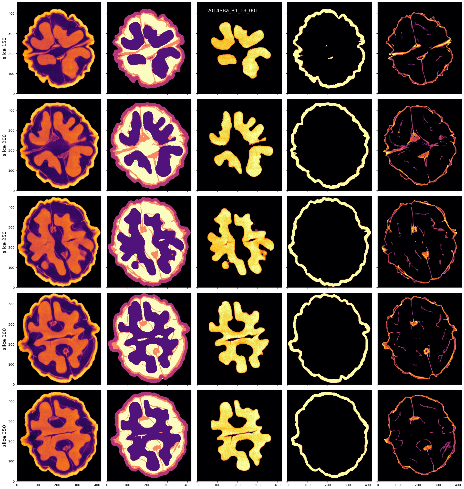
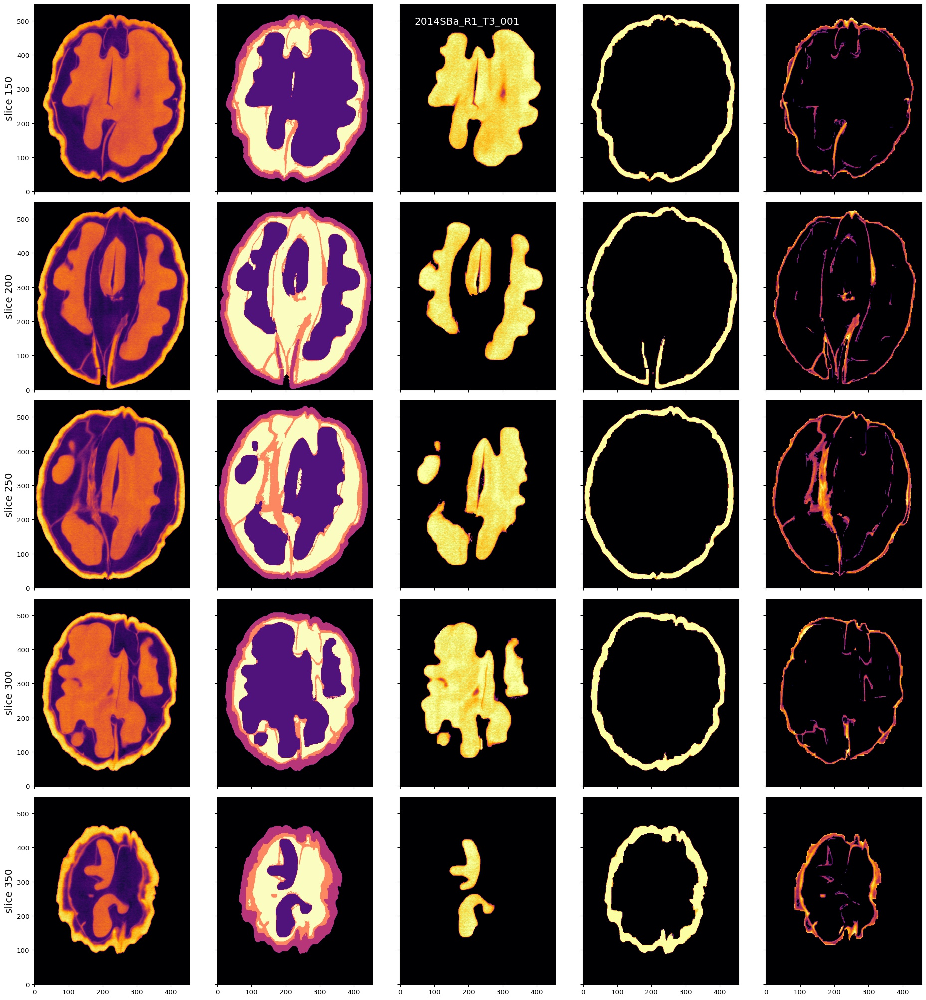
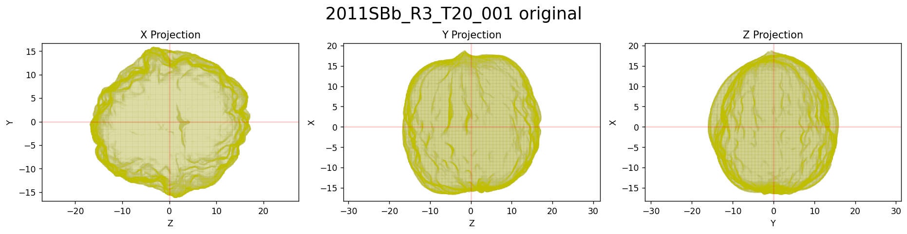
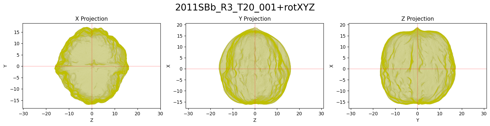
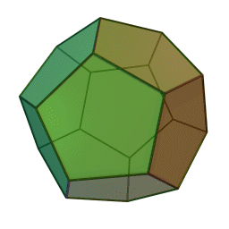
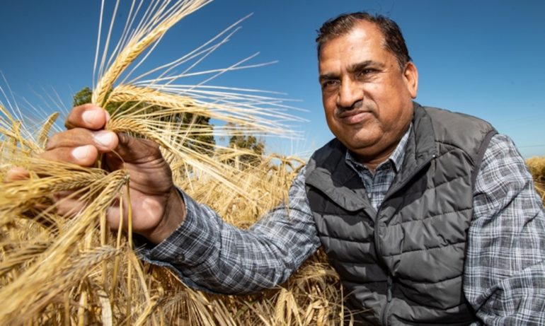
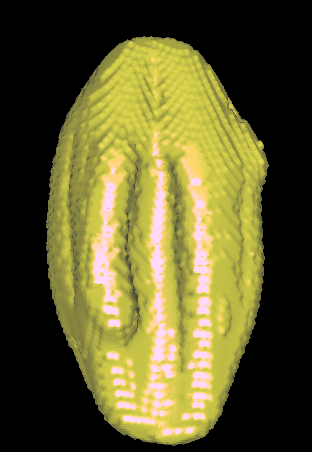
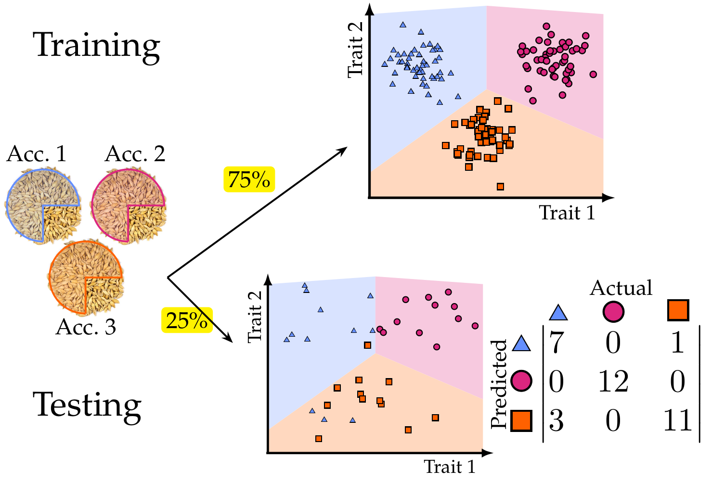
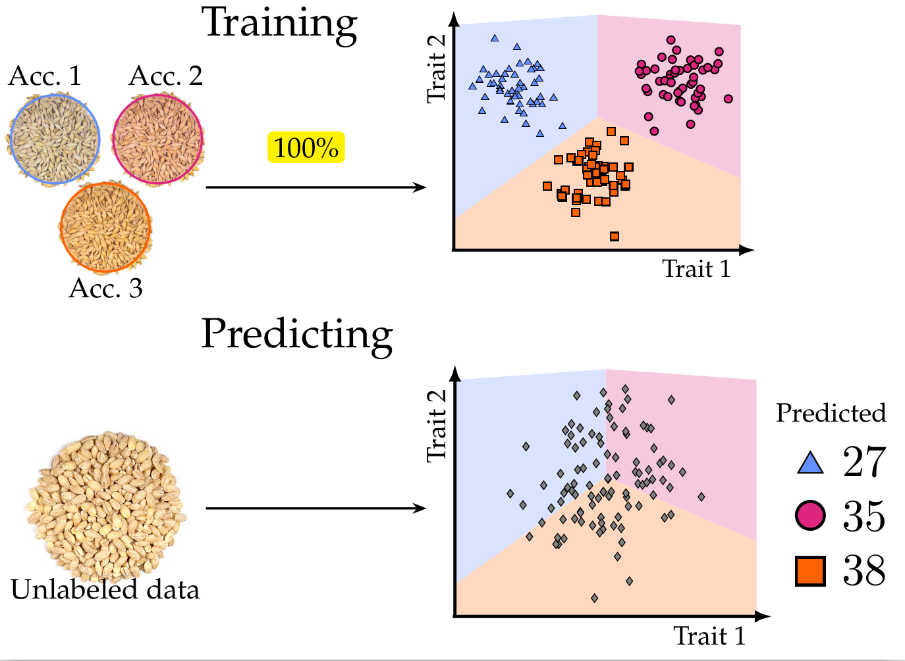

```{r setup, include=FALSE}
library(reticulate)
library(knitr)

options(htmltools.dir.version = FALSE)
knitr::opts_chunk$set(echo = FALSE)
knitr::opts_chunk$set(fig.align = 'center')
```

background-image: url("../../img/endlessforms.png")
background-size: 150px
background-position: 89% 7%

class: inverse

# Plant morphology

<div class="row">
  <div class="column" style="max-width:50%">
    <iframe width="375" height="210" src="https://www.youtube-nocookie.com/embed/Cr0B-yFcJZk?controls=0" frameborder="0" allow="accelerometer; autoplay; encrypted-media; gyroscope; picture-in-picture" allowfullscreen></iframe>
    <iframe width="375" height="210" src="https://www.youtube-nocookie.com/embed/ikhuvGpJbeA?controls=0" frameborder="0" allow="accelerometer; autoplay; encrypted-media; gyroscope; picture-in-picture" allowfullscreen></iframe>
  </div>
  <div class="column" style="max-width:50%">
    <iframe width="375" height="210" src="https://www.youtube-nocookie.com/embed/lZXSpPzstF8?controls=0" frameborder="0" allow="accelerometer; autoplay; encrypted-media; gyroscope; picture-in-picture" allowfullscreen></iframe>
    <iframe width="375" height="210" src="https://www.youtube-nocookie.com/embed/qkOjHHuoUhA?controls=0" frameborder="0" allow="accelerometer; autoplay; encrypted-media; gyroscope; picture-in-picture" allowfullscreen></iframe>
  </div>
</div>
<p style="font-size: 24px; text-align: right; font-family: 'Yanone Kaffeesatz'">Check out more 3D X-ray CT scans at <a href="https://www.youtube.com/@endlessforms6756">youtube.com/@endlessforms6756</a></p>

---

# The wal(nu)tzing nutcracker!

.pull-left[

]

.pull-right[
- 172 batches &rarr; ~1300 walnuts

- Individual walnuts manually separated

- **Plenty of image processing**
]

<div class="row" style="margin: 0 auto;">
  <div class="column" style="max-width:25%; color: Navy; font-size: 15px;">
    
    <p style="text-align: center;"> Shell </p>
  </div>
  <div class="column" style="max-width:25%; color: Navy; font-size: 15px;">
    
    <p style="text-align: center;"> Air </p>
  </div>
  <div class="column" style="max-width:25%; color: Navy; font-size: 15px;">
    
    <p style="text-align: center;"> Packing </p>
  </div>
  <div class="column" style="max-width:25%; color: Navy; font-size: 15px;">
    
    <p style="text-align: center;"> Kernel </p>
  </div>
</div>

---

# Density normalization

.pull-left[

]

.pull-right[

]

---

## Individual walnuts


---

## Watershed segmentation


---

## Watershed segmentation


---

## Watershed segmentation


---

## Watershed segmentation


---

## Watershed segmentation



---

## Watershed segmentation


---

## Watershed segmentation



---

## Watershed segmentation


---

## Watershed segmentation


---

## Watershed segmentation


---

## Orientation


---

## Orientation





---

## Orientation


---

## Interior shell protrusions


---

## Interior shell protrusions


---

## Interior shell protrusions


---

## Interior shell protrusions


---

## Interior shell protrusions


---

## Interior shell protrusions


---

class: inverse, center, middle

# Future directions

## Shape quantification

---

## Phenotypes used by Bertrand et al (2020)

.pull-left[

]

.pull-right[
Some of measurements of the table are duplicates.

Additional measurements we can make

- Relationship to convex hull volume and convex hull surface area (shell and kernel)

- Other sphericity indices

- Volume of packing tissue

- Percentage of volume for each tissue wrt to the total volume

- Volume and percentage of protruding shell
]
---

# Topological Data Analysis (TDA)

<div class="row" style="font-family: 'Yanone Kaffeesatz'">
  <div class="column" style="max-width:25%; font-size: 20px;">
    
    <p style="font-size: 30px; text-align: center; color: DarkRed;"> Raw Data </p>
    <ul>
      <li> X-ray CT </li>
      <li> Point clouds </li>
      <li> Time series </li>
    <ul>
  </div>
  <div class="column" style="max-width:40%; padding: 0 25px 0 25px; font-size: 20px;">
    
    <p style="font-size: 28px; text-align: center; color: DarkRed;"> Topological Summary </p>
    <ul>
      <li> Euler Characteristic </li>
      <li> Persistence diagrams </li>
      <li> Mapper/Reeb graphs </li>
    <ul>
  </div>
  <div class="column" style="max-width:35%; font-size: 20px;">
    
    <p style="font-size: 30px; text-align: center; color: DarkRed;"> Analysis </p>
    <ul>
      <li> Statistics </li>
      <li> Machine learning </li>
      <li> Classification/prediction </li>
    <ul>
  </div>
</div>

---

class: inverse, middle, center

# 1. TDA meets biology in a number of ways

## Shape is data and data is shape

### The significance of detecting connected components and holes

---

# 1st TDA Ingredient: Complexes

- Think the data as a collection of elementary building blocks ( _cells_ )

Vertices | Edges | Faces | Cubes
---------|-------|-------|-------
  0-dim  | 1-dim | 2-dim | 3-dim

- A collection of cells is a _cubical complex_

- Count the number of topological features ( _holes_ ):

Connected components | Loops | Voids
---------------------|-------|-------
       0-dim         | 1-dim | 2-dim

- Example with 2 connected components, 1 loop, 0 voids

```{r, out.width=500}
knitr::include_graphics("../../tda/figs/binary_to_cubical_complex_textless.svg")
```

---

# 2nd TDA Ingredient: Filters

- Each cell is assigned a real value which defines how the complex is constructed.

- Observe how the number of topological features change as the complex grows.

.pull-left[
```{r, out.width="250px"}
knitr::include_graphics(c("../../barley/figs/eigcurv_filter.gif", "../../barley/figs/gaussian_density_filter.gif"))
```
]

.pull-right[
```{r, out.width="250px"}
knitr::include_graphics(c("../../barley/figs/eccentricity_filter.gif", "../../barley/figs/vrips_ver2.gif"))
```
]

---

# Topology: The Euler characteristic $\chi$

$$\chi = \#(\text{Vertices}) - \#(\text{Edges}) + \#(\text{Faces}).$$

<div class="row">
  <div class="column" style="width:5%">
  </div>
  <div class="column" style="max-width:30%">
    
  </div>
  <div class="column" style="max-width:30%">
    
  </div>
  <div class="column" style="max-width:30%">
    
  </div>
  <div class="column" style="width:5%">
  </div>
</div>

<div class="row">
  <div class="column" style="width:5%">
  </div>
  <div class="column" style="max-width:30%">
    
  </div>
  <div class="column" style="max-width:30%">
    
  </div>
  <div class="column" style="max-width:30%">
    <p style="padding: 50px 0 0 10px; font-size: 48px; text-align: center; color: #18453B; line-height: 1.25; font-family: 'Yanone Kaffeesatz';"> V - E + F = 2</p>
  </div>
  <div class="column" style="width:5%">
  </div>
</div>

---

background-image: url("../../barley/figs/ecc_ver2.gif")
background-size: 750px
background-position: 50% 90%

# Euler Characteristic Curve (ECC)

- Consider a cubical complex $X\subset\mathbb{R}^d$
- And a unit-length direction $\nu\in S^{d-1}$

- And the subcomplex containing all cubical cells below height $h$ in the direction $\nu$
$$X(\nu)_h =\{\Delta \in X\::\:\langle x,\nu\rangle\leq h\text{ for all }x\in\Delta\}$$

- The Euler Characteristic Curve (ECC) of direction $\nu$ is defined as the sequence $$\{\chi(X(\nu)_h)\}_{h\in\mathbb{R}}$$
---

background-image: url("../../barley/figs/ect_ver2.gif")
background-size: 800px
background-position: 50% 88%

## Euler Characteristic Transform (ECT)

- Repeat and concatenate for all possible directions.

$$
\begin{split}
ECT(X):\; & S^{d-1} \to \mathbb{Z}^{\mathbb{R}}\\
&\nu\mapsto\{\chi(X(\nu)_h)\}_{h\in\mathbb{R}}.
\end{split}
$$

- [**Theorem** (Turner, Mukherjee, Boyer 2014) & (Curry, Mukherjee, Turner, 2018)](http://arxiv.org/abs/1805.09782):  The ECT is injective with a finite bound of necessary directions.

---

background-image: url("../../barley/figs/amezquita_etal_2021.png")
background-size: 400px
background-position: 50% 95%

class: inverse, middle, center

# Quantifying barley morphology

## Using the Euler Characteristic Transform

---

<div class="row">
  <div class="column" style="max-width:44%">
    <a href="https://cereal.interreg-npa.eu/subsites/CEREAL/Barley_cultivation-Norway_Presentation_2018.pdf" target="_blank"></a>
    <a href="https://www.resilience.org/stories/2020-03-09/the-last-crop-before-the-desert/" target="_blank"></a>
    <a href="https://www.doi.org/10.1007/978-1-4419-0465-2_2168" target="_blank"></a>
  </div>
  <div class="column" style="max-width:44%">
    <a href="https://doi.org/10.2134/agronj1929.00021962002100040014x" target="_blank"></a>
    <div class="row">
      <div class="column" style="max-width:46%">
        
      </div>
      <div class="column" style="max-width:55%">
        
      </div>
    </div>
  </div>
  <div class="column" style="max-width:8%; font-size: 15px;">
    <p style="text-align: center; font-size: 30px; line-height: 1em; color: #18453B;"> <strong> Barley from across the world </strong></p>
    <p>28 collected barley varieties</p>
    <p>Brought to California in 1929</p>
    <p>Artificial evolution experiment for 58 generations</p>
    <p>975 panicles scanned</p>
    <p>38,000 seeds isolated</p>
  </div>
</div>

---

background-image: url("../../barley/figs/S017_L0_seed_10_0.gif")
background-size: 85px
background-position: 90% 2%

# Traditional shape descriptors

<div class="row">
  <div class="column" style="max-width:55%">
    
    
  </div>
  <div class="column" style="max-width:45%">
    
    
    
  </div>
</div>

---

background-image: url("../../barley/figs/ect_ver2.gif")
background-size: 600px
background-position: 50% 98%

# Topological shape descriptors

.pull-left[
```{r, out.width=250}
knitr::include_graphics('../../barley/figs/pole_directions_p7_m12_crop.jpg')
```
]

.pull-right[
- 158 directions

- 16 slices per direction

- Every seed is associated a $158\times16=2528$-dim vector

- Reduced to 12 dimensions with UMAP
]


---

# Supervised Learning



---

# Quantify the shape of barley

**Goal:** Classify the **28** founding barley varieties solely by grain morphology information.

<style type="text/css">
.tg  {border-collapse:collapse;border-color:#93a1a1;border-spacing:0;margin:0px auto;}
.tg td{background-color:#fdf6e3;border-bottom-width:1px;border-color:#93a1a1;border-style:solid;border-top-width:1px;
  border-width:0px;color:#002b36;font-family:Arial, sans-serif;font-size:14px;overflow:hidden;padding:10px 5px;
  word-break:normal;}
.tg th{background-color:#657b83;border-bottom-width:1px;border-color:#93a1a1;border-style:solid;border-top-width:1px;
  border-width:0px;color:#fdf6e3;font-family:Arial, sans-serif;font-size:14px;font-weight:normal;overflow:hidden;
  padding:10px 5px;word-break:normal;}
.tg .tg-2bhk{background-color:#eee8d5;border-color:inherit;text-align:left;vertical-align:top}
.tg .tg-0pky{border-color:inherit;text-align:left;vertical-align:top}
.tg .tg-gyvr{background-color:#eee8d5;border-color:inherit;font-size:100%;text-align:left;vertical-align:top}
</style>
<table class="tg">
<thead>
  <tr>
    <th class="tg-0pky">Shape descriptors</th>
    <th class="tg-0pky">No. of descriptors</th>
    <th class="tg-0pky">F1</th>
  </tr>
</thead>
<tbody>
  <tr>
    <td class="tg-2bhk">Traditional</td>
    <td class="tg-2bhk">11</td>
    <td class="tg-2bhk">0.55 &plusmn; 0.019</td>
  </tr>
  <tr>
    <td class="tg-0pky">Topological</td>
    <td class="tg-0pky">12</td>
    <td class="tg-0pky">0.74 &plusmn; 0.016</td>
  </tr>
  <tr>
    <td class="tg-2bhk">Combined</td>
    <td class="tg-2bhk">23</td>
    <td class="tg-2bhk"><strong>0.86 &plusmn; 0.010</strong></td>
  </tr>
</tbody>
</table>

### What does topology actually measure?

.pull-left[
```{r, out.width=225}
knitr::include_graphics(c('../../barley/figs/discerning_directions.png'))#, '../figs/arrow_seed_09_0.gif'))
```
]

.pull-right[

]

---

# Predicting with Semi-Supervised Learning



---

# Prediction into semi-supervised territory

- Train an SVM with 100% of the founders $(F_0)$

- Classify the progeny $(F_{18}\text{ and }F_{58})$ to detect genotype enrichment

.pull-left[

]

.pull-right[

]

---

background-image: url("../../barley/figs/comparison_lines_combined_topounscaled_d158_T16_horz.png")
background-size: 900px
background-position: 50% 70%

## Observe shape distribution across lines
