```{r setup, include=FALSE}
library(reticulate)
library(knitr)

options(htmltools.dir.version = FALSE)
knitr::opts_chunk$set(echo = FALSE)
knitr::opts_chunk$set(fig.align = 'center')
```

background-image: url("../../img/endlessforms.png")
background-size: 150px
background-position: 89% 7%

class: inverse

# Plant morphology

<div class="row">
  <div class="column" style="max-width:50%">
    <iframe width="375" height="210" src="https://www.youtube-nocookie.com/embed/Cr0B-yFcJZk?controls=0" frameborder="0" allow="accelerometer; autoplay; encrypted-media; gyroscope; picture-in-picture" allowfullscreen></iframe>
    <iframe width="375" height="210" src="https://www.youtube-nocookie.com/embed/ikhuvGpJbeA?controls=0" frameborder="0" allow="accelerometer; autoplay; encrypted-media; gyroscope; picture-in-picture" allowfullscreen></iframe>
  </div>
  <div class="column" style="max-width:50%">
    <iframe width="375" height="210" src="https://www.youtube-nocookie.com/embed/lZXSpPzstF8?controls=0" frameborder="0" allow="accelerometer; autoplay; encrypted-media; gyroscope; picture-in-picture" allowfullscreen></iframe>
    <iframe width="375" height="210" src="https://www.youtube-nocookie.com/embed/qkOjHHuoUhA?controls=0" frameborder="0" allow="accelerometer; autoplay; encrypted-media; gyroscope; picture-in-picture" allowfullscreen></iframe>
  </div>
</div>
<p style="font-size: 24px; text-align: right; font-family: 'Yanone Kaffeesatz'">Check out more 3D X-ray CT scans at <a href="https://www.youtube.com/@endlessforms6756">youtube.com/@endlessforms6756</a></p>

---

# The wal(nu)tzing nutcracker!

.pull-left[

]

.pull-right[
- 172 batches &rarr; 1301 walnuts

- Individual walnuts manually separated

- Walnuts with empty kernels were discarded

- 150 different cultivars (UCCASCD)
]

<div class="row" style="margin: 0 auto;">
  <div class="column" style="max-width:25%; color: Navy; font-size: 15px;">
    
    <p style="text-align: center;"> Shell </p>
  </div>
  <div class="column" style="max-width:25%; color: Navy; font-size: 15px;">
    
    <p style="text-align: center;"> Air </p>
  </div>
  <div class="column" style="max-width:25%; color: Navy; font-size: 15px;">
    
    <p style="text-align: center;"> Packing </p>
  </div>
  <div class="column" style="max-width:25%; color: Navy; font-size: 15px;">
    
    <p style="text-align: center;"> Kernel </p>
  </div>
</div>

---

## Watershed segmentation


---

## Shell interior protrusions


---

## Shape and size phenotypes

.pull-left[
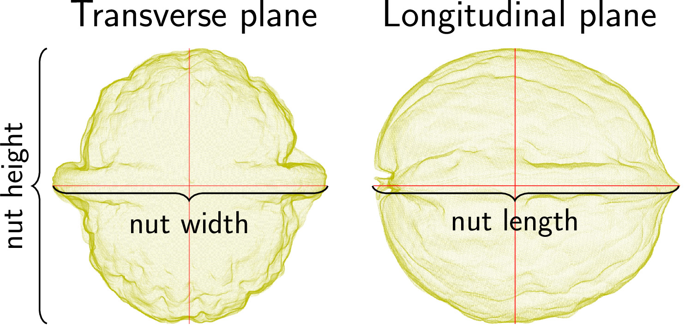

]

.pull-right[
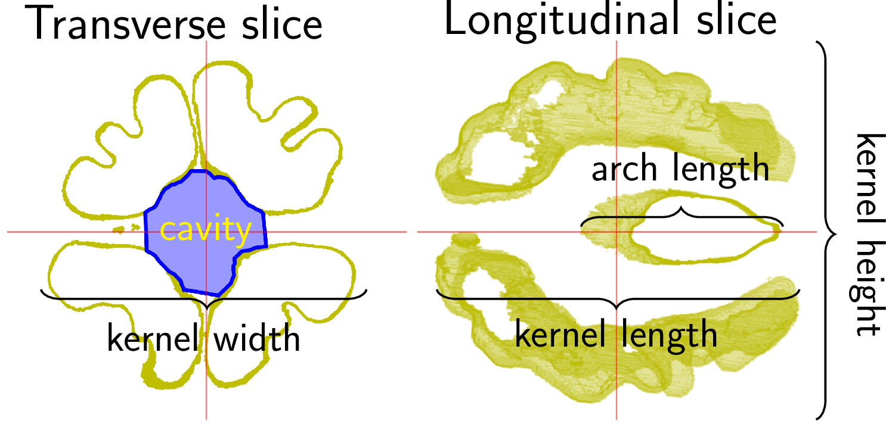
]

```{r, out.width=600}
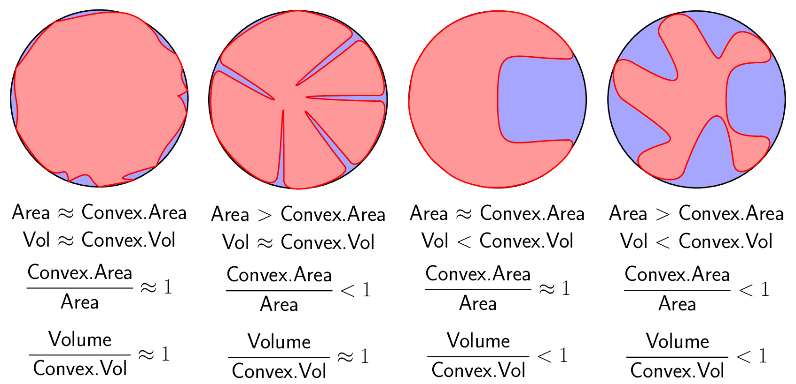
```

---

## Shape and size phenotypes

.pull-left[
**Whole Walnut**

- Length, width, height
- Raw  and *convex* Volume
- Raw and *convex* surface Area
- *Convexity ratios*
- Sphericity indices

**Kernel and its *main cavity***

- Length, width, height
- Raw  and *convex* total volume
- Volume relative to total and *without air*
- Raw and *convex* surface area
- *Convexity ratios*
- *Sphericity indices*
]

.pull-right[
**Shell**

- Absolute and relative total volume
- Absolute and relative *protruding* volume
- Average thickness
- *Average density* relative to kernel
- *Average density* relative to packing tissue

**Air**

- Total and relative volume

***Packing tissue***

- *Absolute and relative total Volume*
- *Relative density to kernel*
]

Italics for phenotypes that I haven't seen measured elsewhere

---

class: center, middle, inverse

# Using **all** the individual nuts' phenotypes

## Each point represents a different individual

### Work that I did early this year

---

# The power of allometry: $\;y = e^bV_N^m$

For most living organisms, different tissues grow at different rates with respect to each other.

Growth does **not** scale linearly but following a power law.

<div class="row" style="color: black; font-size: 20px; font-family: 'Yanone Kaffeesatz'; margin: 0 auto;">
  <div class="column" style="max-width:33%;">
    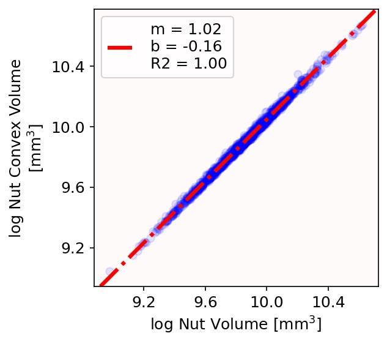
    <p style="padding: 0 2ex 0 0;">Walnut changes dramatically after its diameter is larger than 1.6cm</p>
  </div>
  <div class="column" style="max-width:33%;">
    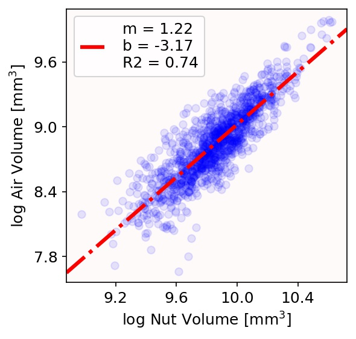
    <p style="margin: 3px 0 0 0; padding: 0 2ex 0 0;">If nut volume increases by 2x, then air volume increases by 2.3x</p>
    <p style="padding: 0 2ex 0 0;">Walnut diameter is below 16cm</p>
  </div>
  <div class="column" style="max-width:33%;">
    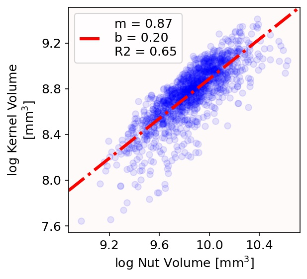
    <p style="margin: 1.1ex 0 0 0; padding: 0 2ex 0 0;">If nut volume increases by 2x, then kernel volume only increases by 1.8x</p>
  </div>
</div>

There are biophysical constraints at play in walnut development

---

## Correlation between tissues

```{r, out.width=550}
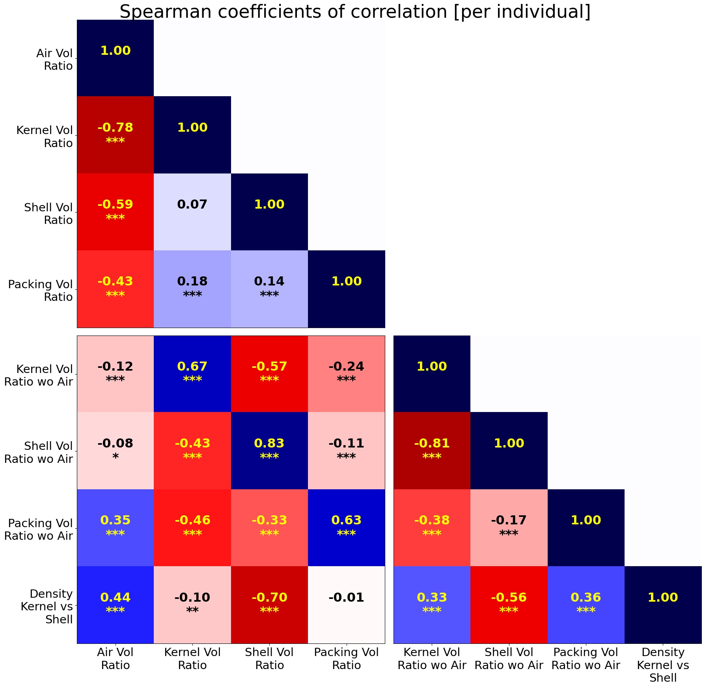
```

---

## Correlation with traits of interest

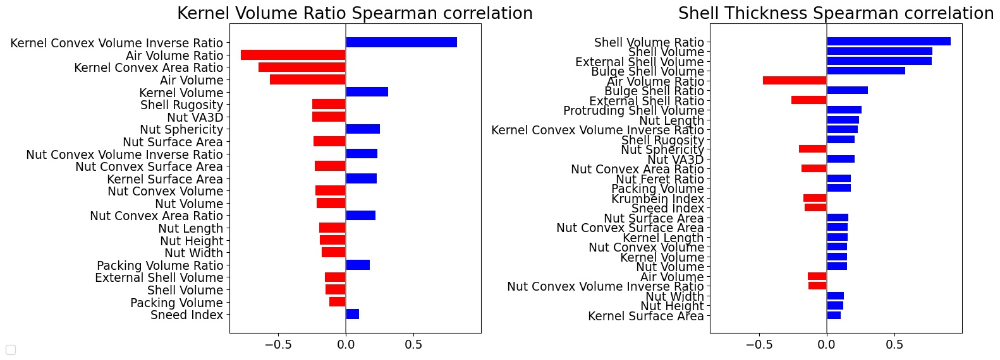

.pull-left[
**Walnuts with more kernel filling ratio have:**

- Less air filling ratio
- Smaller volume
- Smoother shells
- Kernel overall shape is more convex 
- But it also has numerous deep but thin grooves.
] 

.pull-right[
**Walnuts with thinner shells have:**

- Less total shell volume and shell ratio
- More air filling ratio
- Smoother shells
]

---

class: center, middle, inverse

# Incorporating Pat's ordinal data

## Averaging my morphological phenotypes per accession

## Each point represents a different accession

### Work I did after my defense, when I realized I messed up completely data analysis

---

## Comparing relative volume to relative mass

```{r, out.width=550}
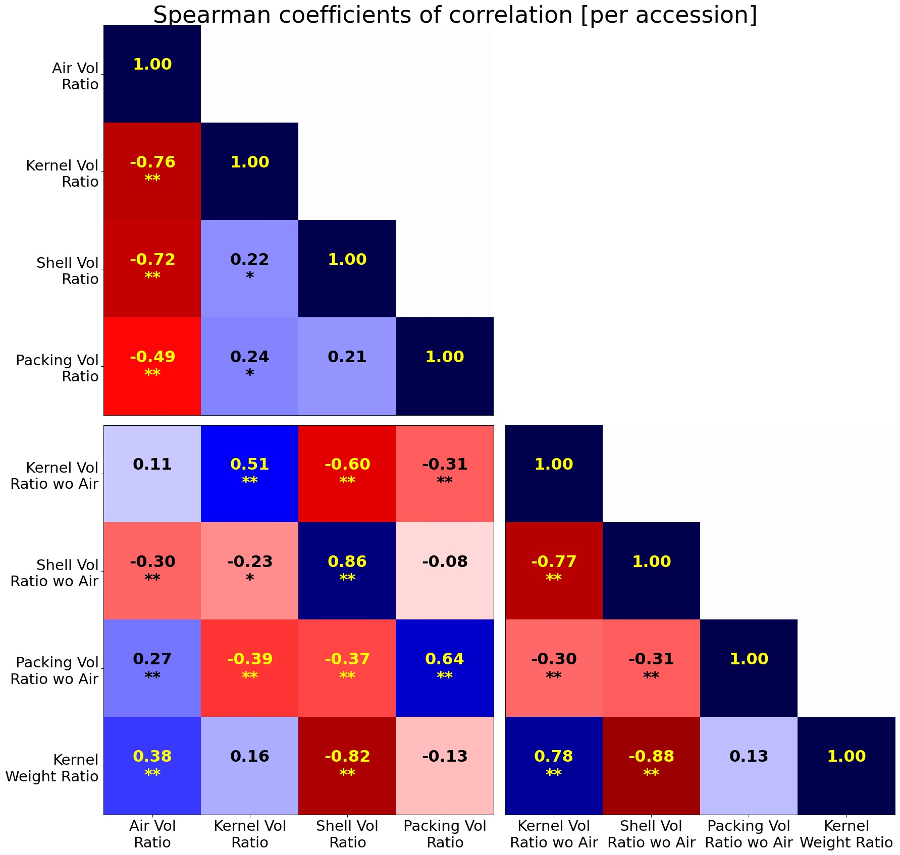
```

---

## Side by side invidual vs accession

.pull-left[

]

.pull-right[

]

---

## Correlation to other breeding traits

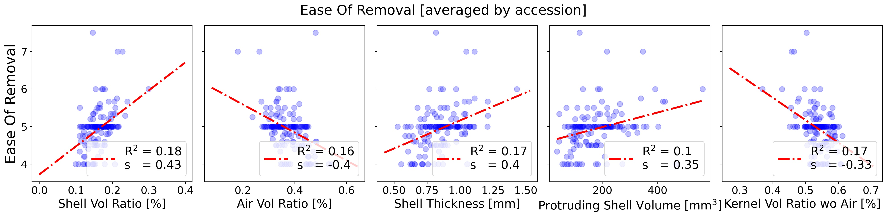

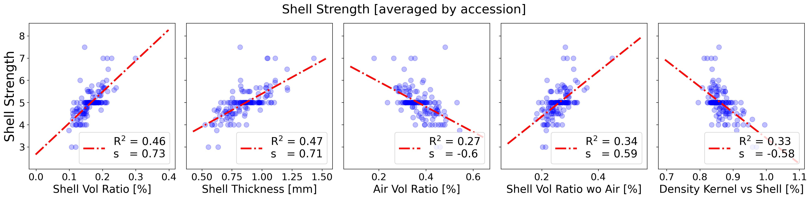

- Now the Earliest (Himalayan) accession is a single outlying point and not much can be said about it.

---

## Correlation to other breeding traits

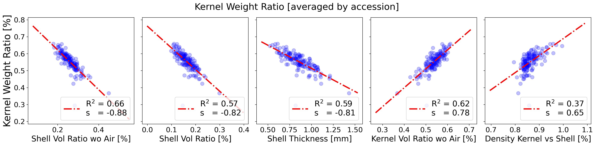

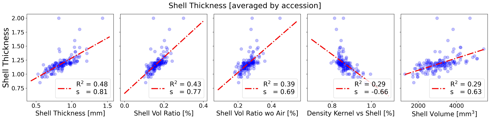

- Now the Earliest (Himalayan) accession is a single outlying point and not much can be said about it.

---

## PCA (and other dim-reduction) fail

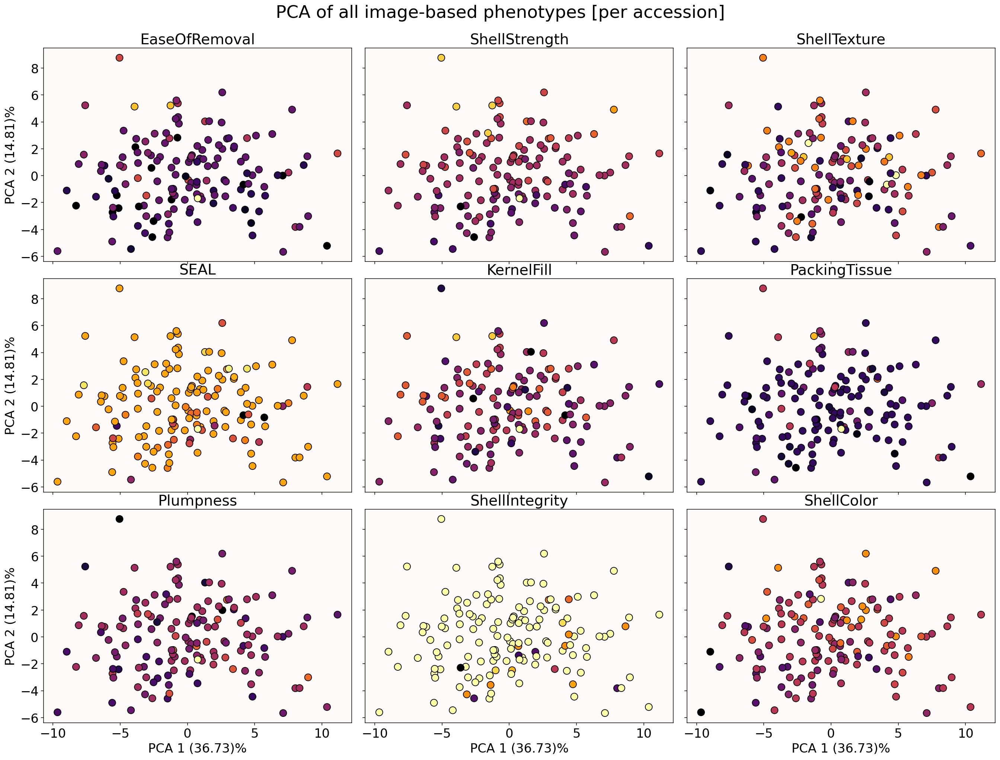

---

## Doing linear regressions

- Assumes responses are normally distributed
- Assumes traits are independent
- I used ridge-regression, as OLS tend to overfit when conditions are not ideal
- Linear coefficients are not really informative when conditions are not ideal


```{r, out.width=550}
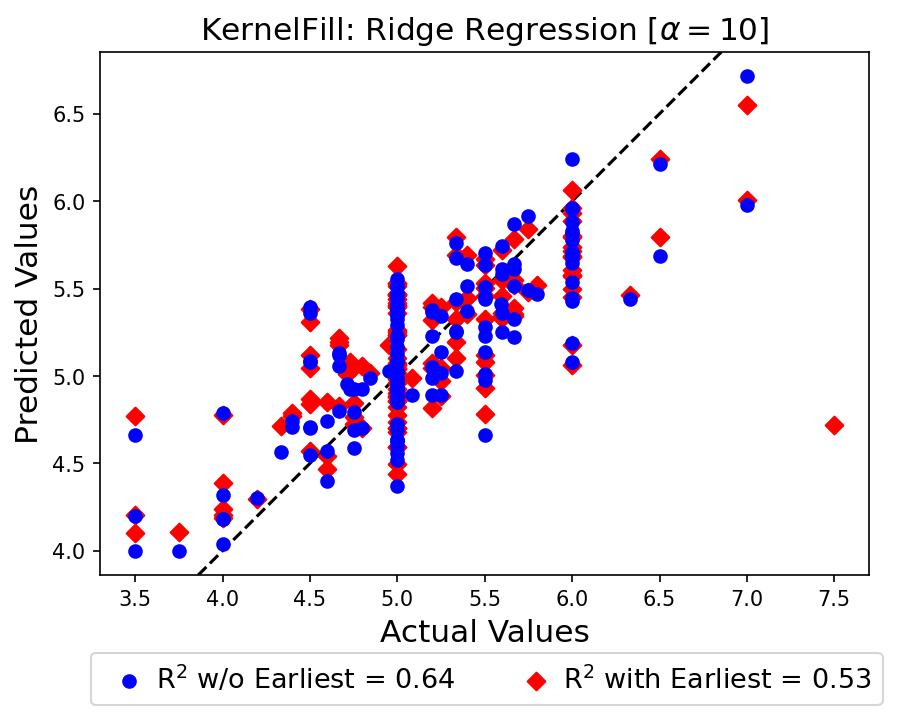
```

---

## Training 80/20 to spot overfitting

.pull-left[
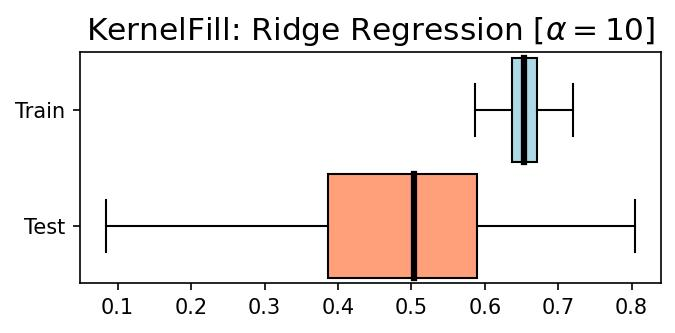
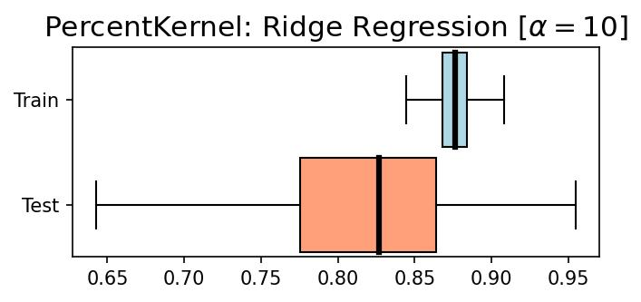
]

.pull-right[
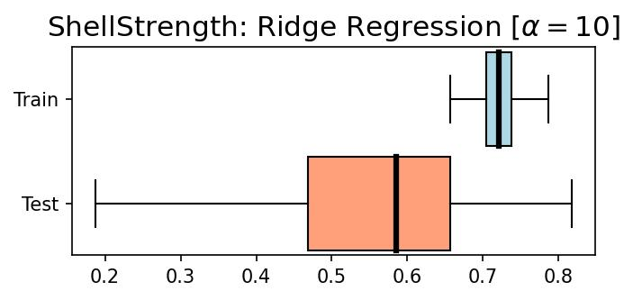
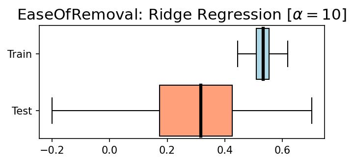
]

- There is some overfitting going on: high variance in test results (?)

---

## Trying to figure out **independent** contributions

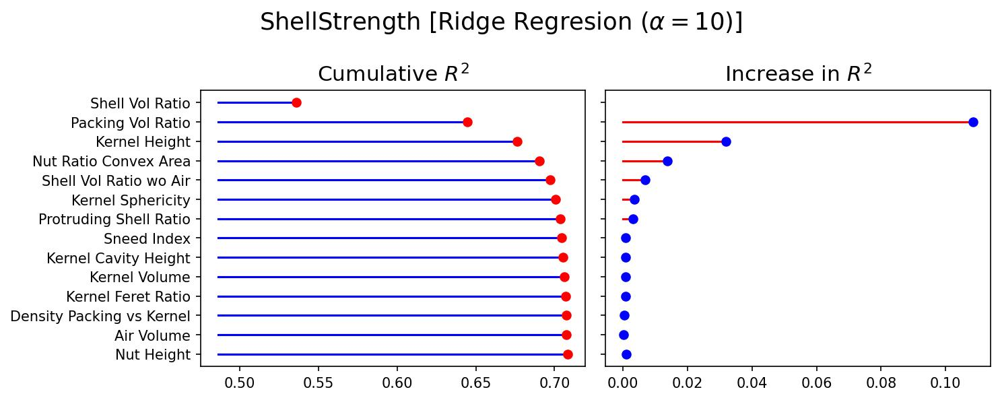

- Shell Vol Ratio is the trait with the highest correlation, so no surprise there

---

## Trying to figure out **independent** contributions

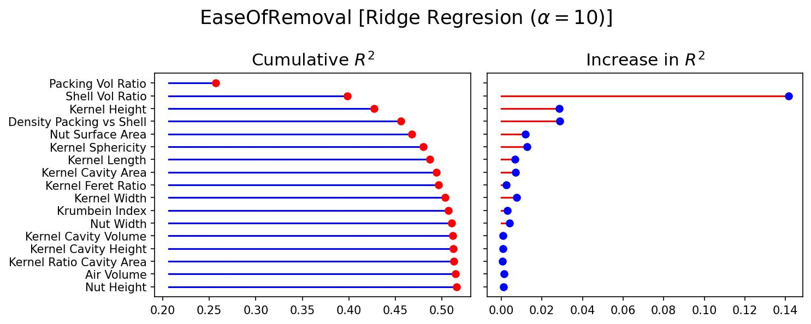